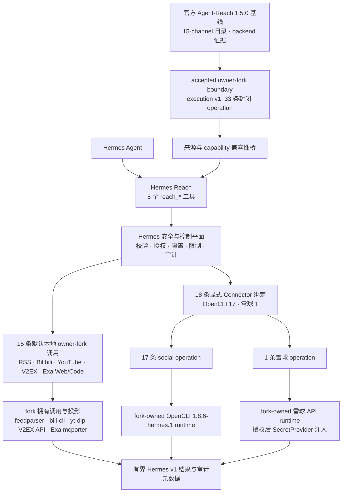
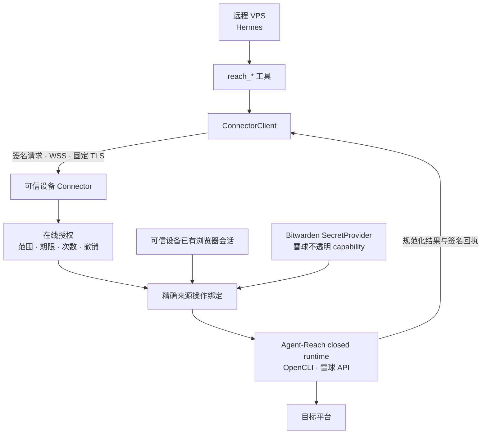

# Hermes Reach

中文 | [English](README_EN.md)

Hermes Reach 让 Hermes 通过一组统一的只读工具读取网页和公开平台，同时为远程 VPS 保留清晰的安全边界。

它固定引入基于官方 [Agent-Reach](https://github.com/Panniantong/Agent-Reach)
审查基线的 [owner fork](https://github.com/izumi0uu/Agent-Reach)。官方基线提供
channel、backend 路由与兼容性证据；fork 的结构化 execution v1 当前直接执行
2 条 RSS、4 条 Bilibili、3 条 YouTube、4 条 V2EX、Exa Web 搜索 1 条，以及
Reddit 7 条、Facebook 4 条、Instagram 4 条、Twitter 搜索 1 条、小红书搜索
1 条、雪球搜索 1 条和 Exa Code 搜索 1 条 operation。Hermes Reach 再通过
[Hermes Agent](https://github.com/NousResearch/hermes-agent) 插件提供搜索、读取、
浏览、转写和状态查询。

> [!IMPORTANT]
> 项目目前处于 **Pre-Alpha**。已冻结边界有 33 条直接 owner-fork operation：RSS 2、
> Bilibili 4、YouTube 3、V2EX 4、Exa Web/Code 2，以及 17 条 OpenCLI social、
> 1 条雪球 operation。前 13 条默认本地可用；Exa Web/Code
> 已有默认本地绑定面，但只有在操作员提供完整 Node/mcporter/config artifact
> 证明后才会组成，否则保持 `setup_required`。远程 Connector 可以显式配置
> 18 条 fork-owned operation，默认 Connector 构成仍为空。Web、GitHub、LinkedIn
> 和其他未审计操作保持规划/不可用；fork 并不使其余 30 条目录 operation 自动可执行。
> PR #6 当前的 33-descriptor 审查候选是
> `ee200e7160c4b093a2ba0fcee9f2a6842aefe20d`（tree
> `56883c0872bed94050660b16d1ade2e46f73fef9`）。它已被当前分支精确固定，
> 但仍未合并、未打 tag 且不可发布；其 35-descriptor 父提交仅保留为
> LinkedIn 拒绝证据。

## 它解决什么问题

当 Hermes 运行在 VPS 上时，它需要访问互联网，但不应该同时得到你的平台密码、Cookie 和平台密钥。

Hermes Reach 将这个问题拆成三个部分：

- Hermes 只调用五个稳定的 `reach_*` 工具
- 每个请求都必须指定来源和只读操作
- 需要账号的能力计划在你的可信设备上执行，而不是把凭据复制到 VPS

例如，你可以让 Hermes 整理 RSS、搜索 Bilibili 视频或读取 YouTube 字幕。它不会因此获得发布内容、修改账号或任意调用平台执行后端的能力。

## 如果 Hermes 运行在 VPS 上

Hermes Reach 假设 VPS 可能被完全攻破。安全设计的目标是限制攻击者能得到什么，而不是假设服务器永远可信。

### 今天已经生效

- 工具只支持读取，不提供发布、评论、点赞或其他外部修改操作
- 请求必须点名来源，不会自动访问全部平台
- 运行时限制超时、响应大小、结果数量和分页
- RSS 等公共 HTTP 获取会阻止本地地址、私有地址、域名重绑定、代理，以及从 HTTPS 跳回不安全 HTTP
- 没有经过审查的执行后端默认关闭，不会自动选择更宽松的替代方案

### 显式启用的 Connector（Pre-Alpha）

Connector 运行在你的电脑或其他可信设备上。密码、Cookie、浏览器会话和 Bitwarden 启动令牌留在该设备，VPS 只能使用有期限、有次数限制且可撤销的授权。

Connector 的身份、在线授权、固定 TLS、原终端解锁、VPS 配对、本地可用性快照、隔离 Bitwarden 取密和请求/结果 envelope 已有基础实现。当前边界可显式激活 17 条 OpenCLI social 和 1 条雪球精确绑定。平台命令、HTTP endpoint、解析和原生投影全部由 Agent-Reach fork 持有；Hermes 只传递封闭 request、验证结果并生成回执。可信设备必须证明各 backend 的精确 closure；雪球 Cookie 只在授权后由 Connector 的 SecretProvider 解析，VPS 只持有不透明 capability ID。任一侧缺失都会失败关闭；默认安装不会查找或运行 backend，也不会复制 Cookie 或浏览器 session 到 VPS。LinkedIn people/jobs 因查询日志、诊断持久化、服务身份绑定和重复提交风险而保持规划/不可用。

部署前需要理解的网络、授权、密钥恢复、审计和回滚边界见 [Connector 安全与运维指南](docs/connector-security.md)。当前激活路径仍是 Pre-Alpha，不是对其他平台、命令或凭据能力的通用授权。

<details>
<summary>查看 Connector 已实现的安全基础</summary>

| 机制 | 作用 |
| --- | --- |
| 设备身份与配对 | 固定可信设备和 VPS 身份，拒绝静默换钥 |
| 原终端（TTY）解锁 | 只允许从前台服务启动时捕获的终端输入密码 |
| SQLite 在线授权 | 原子检查范围、过期、撤销、重放和剩余次数 |
| 安全 WebSocket（WSS）与固定 TLS | 固定证书颁发机构，并校验当前短期证书 |
| 签名回执 | 关联请求、授权版本、执行后端和使用计数 |
| 隔离 Bitwarden 取密 | 在受限子进程中按不透明能力绑定取出单个密钥，不向 VPS 暴露 vault 配置 |
| 请求/结果 envelope | 传输受保护请求，并用签名回执绑定有界规范化结果 |
| VPS 配对与状态快照 | 持久化固定身份、首个授权和不联网的短期健康状态 |
| 前台 ConnectorService | 只在可信设备完成解锁后激活授权服务，并把已授权的精确操作交给显式注入的 executor |

</details>

### 仍然存在的风险

VPS 会看到它获准处理的查询和结果。如果 VPS 在授权有效期内失守，攻击者可能消耗剩余次数。传输层安全协议（TLS）也无法保护已经被攻破的端点。

## 现在可以使用什么

默认安装会注册五个工具，但每个来源是否可用仍以 `reach_status` 的结果为准。

| 状态 | 来源 | 可以做什么 |
| --- | --- | --- |
| 本地可用 | RSS/Atom | 通过 owner fork 的 execution v1 读取 feed 和浏览条目；backend 固定为 `feedparser` |
| 本地可用 | Bilibili | 通过 owner-fork execution v1 搜索和读取视频、浏览热门与排行榜；backend 固定为 `bili-cli` |
| 本地可用 | YouTube | 搜索、视频读取和字幕全部使用 owner-fork execution v1；backend 固定为 `yt-dlp==2026.7.4`，并固定 EJS/Deno 闭包 |
| 本地可用 | V2EX | 通过 owner-fork execution v1 浏览热门/节点主题、读取主题/回复和用户；fork 固定公共 API 及有界传输 |
| 需本地 artifact 配置 | Exa | `search.web` 与 `search.code`；提供完整格式有效的 Node/mcporter/config 路径与摘要声明时组成，执行时再核验实际 artifact |
| 可显式配置 | Reddit | 7 条目录 operation；通过 owner-fork OpenCLI runtime 在可信 Connector 执行，默认不可用 |
| 可显式配置 | Facebook | 4 条目录 operation；Feed/Groups 需要精确 `account_visible` grant，默认不可用 |
| 可显式配置 | Instagram | 4 条目录 operation；Explore 需要精确 `account_visible` grant，默认不可用 |
| 可显式配置 | Twitter/X、小红书 | 各 1 条搜索 operation；复用同一 fork-owned OpenCLI closure，默认不可用 |
| 可显式配置 | 雪球 | `search.stocks`；Cookie 仅由可信 Connector 的 SecretProvider 注入，默认不可用 |
| 已实现、未绑定 | YouTube | `read.comments` 保持 `setup_required`，没有 backend 调用 |
| 规划/不可用 | Web、GitHub、LinkedIn、小宇宙及其余目录操作 | LinkedIn people/jobs 已触发冻结条件；其他操作等待官方 callable 或 Agent-Reach 精确选定 backend 的安全审核 |

五个工具的职责如下：

- `reach_status`：先确认来源和操作是否可用
- `reach_search`：搜索 1 到 5 个明确来源
- `reach_read`：读取一个明确目标
- `reach_browse`：浏览来源原生集合
- `reach_transcribe`：转写受支持的媒体，默认环境暂不可用

无凭据访问不代表无限访问。公共来源仍受平台速率限制、内容可见性和服务条款约束。

## 开始使用

项目尚未发布稳定版。批准的首个公开通道是 GitHub Pre-release，需要
Python 3.11 至 3.13、`uv`、GitHub CLI 和 Hermes Agent 0.19.x。

### 从 GitHub Pre-release 安装

发布工作流只上传三个资产：wheel、sdist 和 `SHA256SUMS`。GitHub 页面还会单独
显示自动生成的 `Source code (zip)` 和 `Source code (tar.gz)` 标签快照；它们
不是工作流上传的资产，也不在 `SHA256SUMS` 或本工作流 attestation 的覆盖范围
内。`v0.1.0a1` 出现在 GitHub Releases 后，可以在任意空目录下载三个工作流资产：

```bash
RELEASE_TAG=v0.1.0a1
RELEASE_DIR="hermes-reach-${RELEASE_TAG}"
gh release download "$RELEASE_TAG" \
  --repo izumi0uu/hermes-reach \
  --dir "$RELEASE_DIR"

gh attestation verify \
  "$RELEASE_DIR/hermes_reach-0.1.0a1-py3-none-any.whl" \
  --repo izumi0uu/hermes-reach \
  --signer-workflow izumi0uu/hermes-reach/.github/workflows/release.yml
gh attestation verify \
  "$RELEASE_DIR/hermes_reach-0.1.0a1.tar.gz" \
  --repo izumi0uu/hermes-reach \
  --signer-workflow izumi0uu/hermes-reach/.github/workflows/release.yml
```

以上两个命令分别验证 wheel 和 sdist，并把签名者限定为本仓库已审核的 release
工作流。`SHA256SUMS` 本身不是 attestation subject；它只记录两个发布包的预期
摘要。然后检查这些摘要。macOS 使用：

```bash
cd "$RELEASE_DIR"
shasum -a 256 --check SHA256SUMS
cd ..
```

GNU/Linux 将第二行换成 `sha256sum --check SHA256SUMS`。Windows 可以用
`Get-FileHash -Algorithm SHA256` 与清单逐项比较。attestation 检查验证每个发布
包的工作流来源；SHA-256 只检测字节是否变化，不能单独证明发布者身份。

必须把 wheel 安装到实际运行 Hermes 的同一个 Python 环境。以下路径是占位符，
不要替换成当前 shell 中碰巧存在的 Python：

```bash
HERMES_PYTHON=/absolute/path/to/hermes-environment/bin/python
HERMES_BIN=/absolute/path/to/hermes-environment/bin/hermes

uv pip install \
  --python "$HERMES_PYTHON" \
  "$RELEASE_DIR/hermes_reach-0.1.0a1-py3-none-any.whl"
uv pip check --python "$HERMES_PYTHON"

"$HERMES_BIN" plugins enable reach --no-allow-tool-override
```

Windows 环境通常使用同一环境下的 `Scripts\python.exe` 和
`Scripts\hermes.exe`。安装 wheel 不会启用插件；上面的显式命令也不会授予
工具覆盖权。启用后请启动新的 Hermes 会话，再检查本地能力：

```bash
"$HERMES_BIN" reach status --json
"$HERMES_BIN" reach sources --json
"$HERMES_BIN" reach doctor --json
```

这个 Pre-release wheel 不是离线依赖包。安装时需要 Git、PyPI 网络和 GitHub
HTTPS，用于取得 `izumi0uu/Agent-Reach` 的精确 owner-fork commit，
并按 wheel 声明解析其余依赖；它不会读取本仓库的 `uv.lock`。发布前必须为该
commit 建立禁止移动和删除的 immutable integration tag，以保证旧安装与回滚仍可
获取它；该 tag 只用于恢复定位，不是依赖选择器，精确 commit 始终是权威 pin。

要回滚 wheel 安装，先停用并启动一个不含 Reach 的新会话，再由同一个 Python
环境的包管理器卸载：

```bash
"$HERMES_BIN" plugins disable reach
uv pip uninstall --python "$HERMES_PYTHON" hermes-reach
uv pip check --python "$HERMES_PYTHON"
```

### 从源码检出开发

在项目根目录安装依赖并启用插件：

```bash
uv sync --all-groups
uv run hermes plugins enable reach --no-allow-tool-override
```

Hermes 的第三方插件默认关闭。启用后请启动新的 Hermes 会话，再检查本地能力：

```bash
uv run hermes reach status --json
uv run hermes reach sources --json
uv run hermes reach doctor --json
```

源码环境的回滚同样必须先停用并启动一个新会话：

```bash
uv run hermes plugins disable reach
```

然后从默认项目环境 `.venv` 卸载：

```bash
uv pip uninstall --python .venv/bin/python hermes-reach
```

Windows 下将解释器路径替换为 `.venv\Scripts\python.exe`。

Hermes 自带的
`plugins remove`、`plugins rm` 和 `plugins uninstall` 只删除
`HERMES_HOME/plugins` 下的目录插件，不能卸载 pip wheel。先停用再卸载可以
避免遗留的启用配置在以后重装同名插件时自动生效。在源码检出目录再次运行
`uv sync` 会重新安装当前项目；如果只是希望长期关闭插件，保持 disabled
状态即可。

启动会话时加载 `reach:agent-reach` 路由规则，并启用 `reach` 工具组。然后可以直接描述任务：

```text
先检查 YouTube 字幕读取是否可用，
再读取指定视频的中文字幕。
```

默认的 `doctor` 只检查本地状态。`hermes reach doctor --upstream` 会额外运行经过限制和脱敏的 Agent-Reach 上游检查。

### 启用 Exa Web 搜索

Exa Web 不使用 API key，也不会自动从 PATH、npm、编辑器或用户配置中发现
Node/mcporter。操作员必须先准备审核过的 `mcporter==0.12.3` artifact 闭包与
无凭据配置，再在启动 Hermes 的同一环境中一次性提供全部七个值：

```bash
export HERMES_REACH_EXA_NODE_EXECUTABLE=/absolute/path/to/node
export HERMES_REACH_EXA_NODE_SHA256=<64-lowercase-hex>
export HERMES_REACH_EXA_MCPORTER_ROOT=/absolute/path/to/mcporter
export HERMES_REACH_EXA_MCPORTER_CLI=/absolute/path/to/mcporter/dist/cli.js
export HERMES_REACH_EXA_MCPORTER_TREE_SHA256=<64-lowercase-hex>
export HERMES_REACH_EXA_CONFIG_PATH=/absolute/path/to/sterile-config.json
export HERMES_REACH_EXA_CONFIG_SHA256=<64-lowercase-hex>
```

本仓库不会安装该 artifact，也不附带可直接复用的生产摘要；这些值必须来自
操作员对实际部署闭包的审核记录，不要从未审核的全局安装临时拼出一组值。
当前版本也没有自动 provisioning 或 attestation 生成器，因此默认保持
`setup_required` 是有意的安全状态。
七项全缺、只提供一部分或格式错误时，`exa:search.web` 和 `exa:search.code` 都是
`setup_required`，且不会探测或执行 backend。配置后启动新 Hermes
进程并用 `reach status` 验证组成状态；`available` 只证明声明格式完整，实际文件、
摘要、版本和依赖树会在第一次执行的隔离 worker 中重新核验。查询不会进入
Hermes 回执或审计，但会发送给 Exa，Exa 可能保留它。Web 与 Code 使用不同的
固定 MCP endpoint、方法和结果 grammar，不能互相回退。

### 启用 OpenCLI social 和雪球

先在可信设备初始化状态，并以前台进程启动完整的 OpenCLI social executor：

```bash
uv run hermes reach connector init \
  --role connector \
  --state-directory /absolute/connector-state

uv run hermes reach connector serve \
  --state-directory /absolute/connector-state \
  --bind 100.64.0.10 \
  --port 8765 \
  --opencli-social-node /absolute/path/to/node \
  --opencli-social-root /absolute/opencli-production-prefix \
  --opencli-social-cli /absolute/opencli-production-prefix/node_modules/@jackwener/opencli/dist/src/main.js \
  --opencli-social-session-home /absolute/trusted-session-home \
  --xueqiu-binding-manifest /absolute/owner-only-xueqiu-binding.json
```

四个 `--opencli-social-*` 参数必须全部提供或全部省略。配置后包含 17 条精确
OpenCLI scope；Twitter 和小红书不会获得通用命令能力。雪球只接收
owner-only `--xueqiu-binding-manifest`；manifest 不能包含 Cookie、token、Bitwarden
bootstrap/access token、provider 选择或 injection target。它精确包含
`protocol_version`、`capability_id`、`project_id`、`selector`、`profile_home`、
`bws_sha256` 和 `server_url`；这些 locator 留在可信设备，不进入 TTY、VPS wire、
回执、审计或日志。`serve` 对所有已配置组只进行一次
TTY `enable` 确认，且不显示本地路径或 secret locator。确认后，在同一个原终端的
`Connector>` 提示符输入 `unlock` 并提供 Connector 密码；监听器只会在解锁成功后
启动。保持该前台进程运行，然后在 VPS 初始化并按需配对精确 scope。

LinkedIn 没有激活参数。people/jobs 搜索因 MCP 4.14.0 会在 `WARNING` 记录带查询
URL、错误路径会持久化查询诊断、Hermes 无法把 wheel/log level/12 秒 timeout
绑定到现有服务身份，以及 `section_errors` 可能与重试造成重复提交而保持规划/
不可用。完整证据见 [LinkedIn 冻结决策](docs/agent-reach-decisions/linkedin-scraper-mcp-4.14.0.md)。

```bash
uv run hermes reach connector init \
  --role vps \
  --state-directory /absolute/vps-state

uv run hermes reach connector pair \
  --state-directory /absolute/vps-state \
  --connector wss://100.64.0.10:8765 \
  --device-label hermes-vps \
  --scope reddit:read.post:public \
  --scope instagram:browse.explore:account_visible
```

`pair` 等待期间，在可信设备的 `Connector>` 提示符输入 `pending`，核对两端显示后输入 `approve <pairing-id>`，并在确认提示中输入字面量 `approve`。配对完成后可在可信设备再次输入 `lock` 停止监听，或保持解锁以执行请求。

最后用同一个绝对状态目录启动 VPS 上的 Hermes 进程：

```bash
HERMES_REACH_VPS_STATE_DIRECTORY=/absolute/vps-state hermes ...
```

这个环境变量只是 owner-only 本地配对状态的指针，不是密钥，也不会扩大 grant。配对或本地状态变化后必须重启 Hermes；服务端撤销则在下一次请求立即生效。有效 grant 在首次签名成功前通常显示 `degraded`，成功后变为 `available`。同一签名 invocation 内只有 typed transient/unavailable/deadline 结果允许最多一次内部重试，两次 attempt 共用原始 20 秒 deadline，不会再次消耗 grant。如果此前收到过签名的 `backend_unbound`，修复可信端绑定后，本地失败快照最多约 60 秒才会回到可重试的 `degraded`。完整运维说明见 [Connector 安全与运维指南](docs/connector-security.md)。

## 系统如何工作

Hermes Reach 通过 `hermes_reach.register` 集成精确固定的 Agent-Reach owner
fork。官方基线提供 15-channel registry、backend 路由证据、兼容性元数据和受限
doctor；fork 的 execution v1 当前拥有 2 条 RSS、4 条 Bilibili、3 条 YouTube、
4 条 V2EX、2 条 Exa 与 18 条 Connector-only operation。
Hermes Reach 提供五个封闭工具、安全策略、host capability、Connector、规范化
和审计。当前没有 Hermes-owned platform runtime 或精确 backend 薄包装。



### Agent-Reach 用到了什么程度

15-channel registry、backend 元数据和官方兼容性基线来自官方 Agent-Reach。
owner fork 的 execution v1 直接执行 2 条 RSS、4 条 Bilibili、3 条 YouTube、
4 条 V2EX、2 条 Exa 与 18 条 Connector-only operation。当前 Hermes 产品目录有 63 个只读
operation：34 个标记已实现、29 个规划中；33 个有 concrete executor，全部
是 owner-fork runtime。15 个 binding surface 是默认本地，18 个是 Connector-only。Exa 的 executor
虽已实现，但缺少完整 artifact 证明时不会组成并保持 `setup_required`。另有
1 个 `youtube:read.comments` 已实现但未绑定，因此不计入 concrete executor。

官方 Agent-Reach 1.5.0 没有统一、结构化的 operation execution API，所以直接
调用官方 runtime 的数量仍是 0。经过审查的 owner fork 只补充
operation-scoped 执行边界，目前恰好是 33 条封闭调用；它不是 15-channel 通用
runtime。Web、GitHub、V2EX 的 13 条旧 Hermes 平台实现仍全部关闭，其中 V2EX
只通过新的 fork descriptor 重新启用；当前 Hermes-native 和重复实现例外均为 0。

Hermes Reach 只拥有协议、授权、host capability、安全调用、规范化、限制、脱敏、
回执和审计；33 条直接 operation 的 backend 调用和平台投影属于精确 owner
fork。OpenCLI 命令和雪球 HTTP 语义只存在于 fork；LinkedIn 没有可执行路径。
完整架构见 [Agent-Reach 插件边界](docs/agent-reach-plugin-boundary.md)，
操作矩阵和重新启用条件见
[Agent-Reach 复用边界](docs/agent-reach-reuse-boundary.md)。

项目固定使用 Agent-Reach `1.5.0`：官方审查基线是
`b4d52c46c9113cb0f653d6df4cf71ebadf4930ac`，execution protocol 是 `v1`。
完整的 63 行状态以
[operation ledger](docs/agent-reach-operation-ledger.json) 为准；33 个 descriptor
不能代表其他 30 行可执行。当前精确 owner-fork 候选 pin 是
`ee200e7160c4b093a2ba0fcee9f2a6842aefe20d`（tree
`56883c0872bed94050660b16d1ade2e46f73fef9`）；它是 PR #6 当前已审查的
33-descriptor head，但仍未合并、未打 tag 且不可发布。其 pre-freeze 父提交
`7bc42839d3dd290e4af93b24e0b03b738cff0ffa`（tree
`382557e0bec76819f0633f31895580a0f549b6bd`）包含已拒绝的 LinkedIn descriptor，
仅作历史证据。回滚到
`281dc3352c63cdb644f02e028cc5d645c279954a` 会关闭本批四条已接受搜索 binding，且不需要
协议、grant、Connector、数据库、回执或审计迁移。更早的集成记录仍保留在
[发布指南](docs/releasing.md) 中；恢复 tag 只用于历史定位，不是依赖选择器。

### 显式组成时的 Connector 路径

精确绑定可以在可信设备中执行经过审查的来源后端。当前 17 条 social operation
调用 fork 的 OpenCLI runtime，雪球 1 条在授权后解析一个不透明 SecretProvider
capability。VPS 不能选择命令、endpoint、
方法、凭据、执行后端、浏览器会话、本地路径或 scope。默认构成不提供这些绑定；
只有对应完整 artifact/manifest、一次字面量 `enable` 确认与已配对 VPS 精确 grant
同时存在时才组成它们。



## 未来路线图

Roadmap 表示开发顺序，不承诺发布日期。未完成的能力会保持关闭。

| 阶段 | 目标 | 主要工作 |
| --- | --- | --- |
| 已完成 | 稳定公共读取面 | 五个工具、63-operation Hermes 产品目录、只读策略、官方 Agent-Reach registry 桥 |
| 已完成 | 安全配对与客户端基础 | ConnectorClient、固定身份与授权、本地可用性快照、签名请求和回执 |
| 已完成 | 隔离凭据并冻结执行协议 | Bitwarden SecretProvider、受保护请求与规范化结果 envelope |
| 已完成 | 精确远程执行桥 | 显式 Connector 适配器、已授权操作交付、回执与重试；默认构成仍为空 |
| 已完成 | 首个 Connector executor | 早期 Reddit `read.post` wrapper 验证了 WSS、grant 和回执边界，现已由 fork-owned social runtime 替代 |
| 已完成 | 双端显式生产组成 | 可信设备证明 Node/OpenCLI/session 能力并确认启用；VPS 从 owner-only 配对状态组成精确 social adapter |
| 已完成 | 29 条封闭 owner-fork execution | RSS 2、Bilibili 4、YouTube 3、V2EX 4、Exa Web 1、Reddit 7、Facebook 4、Instagram 4；YouTube comments 保持未绑定 |
| 已完成 | 冻结严格插件边界 | 关闭 Web/GitHub/V2EX 共 13 条 Hermes 平台例外；V2EX 只通过新的 fork descriptor 重新启用，Web/GitHub 仍不可用 |
| 已完成 | 验证真实插件生命周期 | 在全新 Hermes 0.19 环境验证默认关闭、启用、停用和包管理器卸载 |
| 已完成 | 完成公共平台批次交付 | rebase 集成 fork、证明最终 tree 等于被审查 tree、固定最终 SHA，并重跑所有 pin-sensitive gate |
| 现在 | 收口四条搜索接入 | Twitter、小红书、雪球和 Exa Code 已构成并固定 33-descriptor 候选；LinkedIn people/jobs 保持规划/不可用，下一个门禁是 PR #6 rebase 合并后的 tree 等价证明与最终 pin 复核 |
| 随后 | 建立公开 Pre-release 通道 | 先为最终 fork commit 建立受保护的 immutable recovery tag，再离线安装同一 exact sdist、对同一 exact wheel 跑完整生命周期，然后摘要并验证两者的 GitHub provenance，以最小权限发布 |
| 后续 | 扩展剩余认证操作和生产运维 | Twitter/X 尚未接入的读取操作、现有搜索路径加固、一键授权、审计导出、告警、升级与回滚 |

## 开发

项目使用 `uv` 管理环境和锁文件：

```bash
uv sync --all-groups
uv run ruff check .
uv run ruff format --check .
uv run mypy src
uv run pytest
uv lock --check
uv build
```

维护者发布步骤和仓库保护前提见 [发布指南](docs/releasing.md)。

Hermes Reach 当前版本为 `0.1.0a1`，使用 [MIT License](LICENSE)。
