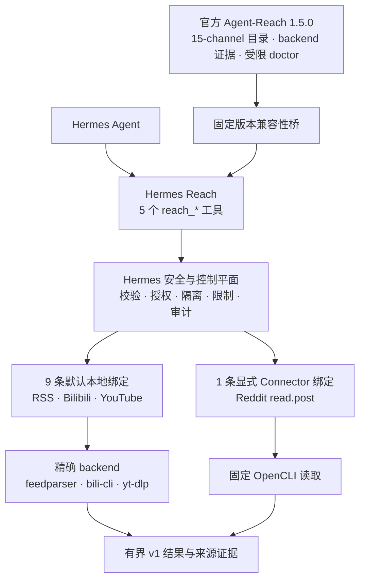
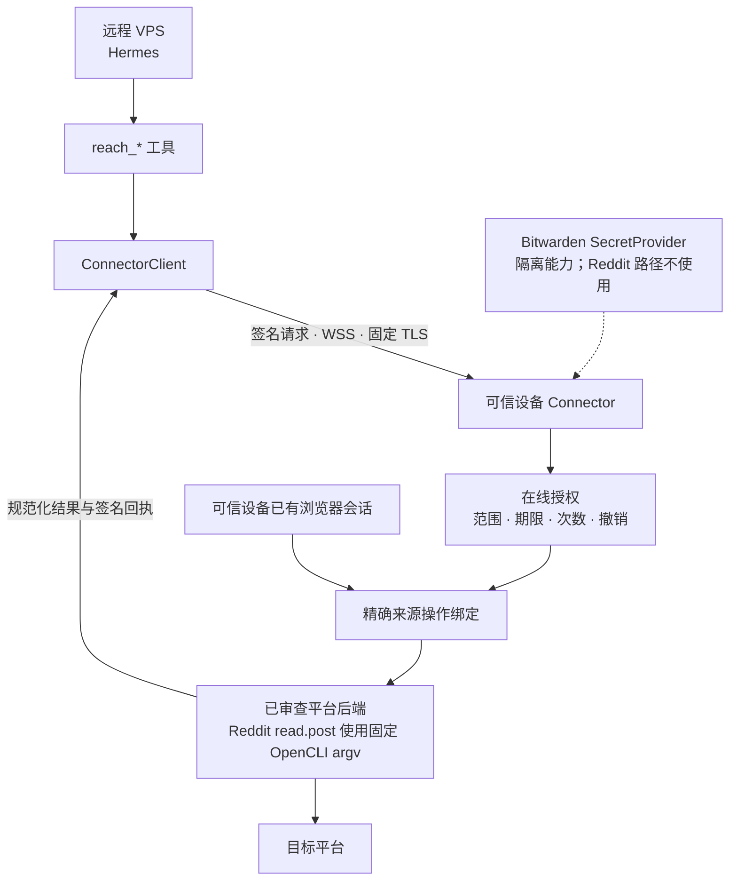

# Hermes Reach

中文 | [English](README_EN.md)

Hermes Reach 让 Hermes 通过一组统一的只读工具读取网页和公开平台，同时为远程 VPS 保留清晰的安全边界。

它固定引入官方 [Agent-Reach](https://github.com/Panniantong/Agent-Reach) 作为 channel、backend 路由与兼容性证据来源，并通过 [Hermes Agent](https://github.com/NousResearch/hermes-agent) 插件提供搜索、读取、浏览、转写和状态查询。

> [!IMPORTANT]
> 项目目前处于 **Pre-Alpha**。RSS/Atom、Bilibili 和 YouTube 的 9 条固定后端路径已可本地使用。远程 Connector 可以通过双端显式配置启用唯一的 Reddit `read.post` OpenCLI 路径，但默认 Connector 构成仍然为空；Web、GitHub、V2EX 和其他未审计平台保持规划/不可用。

## 它解决什么问题

当 Hermes 运行在 VPS 上时，它需要访问互联网，但不应该同时得到你的平台密码、Cookie 和平台密钥。

Hermes Reach 将这个问题拆成三个部分：

- Hermes 只调用五个稳定的 `reach_*` 工具
- 每个请求都必须指定来源和只读操作
- 需要账号的能力计划在你的可信设备上执行，而不是把凭据复制到 VPS

例如，你可以让 Hermes 整理 RSS、搜索 Bilibili 视频或读取 YouTube 字幕。它不会因此获得发布内容、修改账号或任意调用平台执行后端的能力。

## 如果 Hermes 运行在 VPS 上

Hermes Reach 假设 VPS 可能被完全攻破。安全设计的目标是限制攻击者能得到什么，而不是假设服务器永远可信。

### 今天已经生效

- 工具只支持读取，不提供发布、评论、点赞或其他外部修改操作
- 请求必须点名来源，不会自动访问全部平台
- 运行时限制超时、响应大小、结果数量和分页
- RSS 等公共 HTTP 获取会阻止本地地址、私有地址、域名重绑定、代理，以及从 HTTPS 跳回不安全 HTTP
- 没有经过审查的执行后端默认关闭，不会自动选择更宽松的替代方案

### 显式启用的 Connector（Pre-Alpha）

Connector 运行在你的电脑或其他可信设备上。密码、Cookie、浏览器会话和 Bitwarden 启动令牌留在该设备，VPS 只能使用有期限、有次数限制且可撤销的授权。

Connector 的身份、在线授权、固定 TLS、原终端解锁、VPS 配对、本地可用性快照、隔离 Bitwarden 取密和请求/结果 envelope 已有基础实现。`reddit:read.post` 是第一个可显式激活的精确绑定：它只从规范 Reddit URL 提取帖子 ID，再执行固定的 OpenCLI 读取命令。可信设备必须通过 `--reddit-opencli` 确认可执行文件身份，VPS 也必须显式指向已配对且包含精确 `reddit:read.post:public` grant 的本地状态。任一侧缺失都会失败关闭；默认安装不会查找或运行 OpenCLI。

部署前需要理解的网络、授权、密钥恢复、审计和回滚边界见 [Connector 安全与运维指南](docs/connector-security.md)。当前激活路径仍是 Pre-Alpha，不是对其他平台、命令或凭据能力的通用授权。

<details>
<summary>查看 Connector 已实现的安全基础</summary>

| 机制 | 作用 |
| --- | --- |
| 设备身份与配对 | 固定可信设备和 VPS 身份，拒绝静默换钥 |
| 原终端（TTY）解锁 | 只允许从前台服务启动时捕获的终端输入密码 |
| SQLite 在线授权 | 原子检查范围、过期、撤销、重放和剩余次数 |
| 安全 WebSocket（WSS）与固定 TLS | 固定证书颁发机构，并校验当前短期证书 |
| 签名回执 | 关联请求、授权版本、执行后端和使用计数 |
| 隔离 Bitwarden 取密 | 在受限子进程中按不透明能力绑定取出单个密钥，不向 VPS 暴露 vault 配置 |
| 请求/结果 envelope | 传输受保护请求，并用签名回执绑定有界规范化结果 |
| VPS 配对与状态快照 | 持久化固定身份、首个授权和不联网的短期健康状态 |
| 前台 ConnectorService | 只在可信设备完成解锁后激活授权服务，并把已授权的精确操作交给显式注入的 executor |

</details>

### 仍然存在的风险

VPS 会看到它获准处理的查询和结果。如果 VPS 在授权有效期内失守，攻击者可能消耗剩余次数。传输层安全协议（TLS）也无法保护已经被攻破的端点。

## 现在可以使用什么

默认安装会注册五个工具，但每个来源是否可用仍以 `reach_status` 的结果为准。

| 状态 | 来源 | 可以做什么 |
| --- | --- | --- |
| 本地可用 | RSS/Atom | 读取 feed 和浏览条目；2 条固定 `feedparser` 路径 |
| 本地可用 | Bilibili | 搜索和读取视频，浏览热门与排行榜；4 条固定 `bili-cli` 路径 |
| 本地可用 | YouTube | 搜索和读取视频、读取字幕；3 条固定 `yt-dlp` 路径 |
| 可显式配置 | Reddit | 仅 `read.post`；需要可信设备和 VPS 双端显式激活，默认仍不可用 |
| 已实现、未绑定 | YouTube | `read.comments` 保持 `setup_required`，没有 backend 调用 |
| 规划/未绑定 | Exa | `reach_status` 报告 `setup_required`，无 binding；等待固定 `mcporter` 执行闭包和留存审核 |
| 规划/不可用 | Web、GitHub、V2EX、Twitter/X、小红书、Facebook、Instagram、LinkedIn、雪球、小宇宙，以及 Reddit 其余操作 | 等待官方 callable 或 Agent-Reach 精确选定 backend 的安全审核 |

五个工具的职责如下：

- `reach_status`：先确认来源和操作是否可用
- `reach_search`：搜索 1 到 5 个明确来源
- `reach_read`：读取一个明确目标
- `reach_browse`：浏览来源原生集合
- `reach_transcribe`：转写受支持的媒体，默认环境暂不可用

无凭据访问不代表无限访问。公共来源仍受平台速率限制、内容可见性和服务条款约束。

## 开始使用

项目尚未发布稳定版。批准的首个公开通道是 GitHub Pre-release，需要
Python 3.11 至 3.13、`uv`、GitHub CLI 和 Hermes Agent 0.19.x。

### 从 GitHub Pre-release 安装

发布工作流只上传三个资产：wheel、sdist 和 `SHA256SUMS`。GitHub 页面还会单独
显示自动生成的 `Source code (zip)` 和 `Source code (tar.gz)` 标签快照；它们
不是工作流上传的资产，也不在 `SHA256SUMS` 或本工作流 attestation 的覆盖范围
内。`v0.1.0a0` 出现在 GitHub Releases 后，可以在任意空目录下载三个工作流资产：

```bash
RELEASE_TAG=v0.1.0a0
RELEASE_DIR="hermes-reach-${RELEASE_TAG}"
gh release download "$RELEASE_TAG" \
  --repo izumi0uu/hermes-reach \
  --dir "$RELEASE_DIR"

gh attestation verify \
  "$RELEASE_DIR/hermes_reach-0.1.0a0-py3-none-any.whl" \
  --repo izumi0uu/hermes-reach
```

然后检查两个包文件的传输摘要。macOS 使用：

```bash
cd "$RELEASE_DIR"
shasum -a 256 --check SHA256SUMS
cd ..
```

GNU/Linux 将第二行换成 `sha256sum --check SHA256SUMS`。Windows 可以用
`Get-FileHash -Algorithm SHA256` 与清单逐项比较。GitHub attestation 验证
制品由这个仓库的 Actions 工作流产生；SHA-256 只检测字节是否变化，不能单独
证明发布者身份。

必须把 wheel 安装到实际运行 Hermes 的同一个 Python 环境。以下路径是占位符，
不要替换成当前 shell 中碰巧存在的 Python：

```bash
HERMES_PYTHON=/absolute/path/to/hermes-environment/bin/python
HERMES_BIN=/absolute/path/to/hermes-environment/bin/hermes

uv pip install \
  --python "$HERMES_PYTHON" \
  "$RELEASE_DIR/hermes_reach-0.1.0a0-py3-none-any.whl"
uv pip check --python "$HERMES_PYTHON"

"$HERMES_BIN" plugins enable reach --no-allow-tool-override
```

Windows 环境通常使用同一环境下的 `Scripts\python.exe` 和
`Scripts\hermes.exe`。安装 wheel 不会启用插件；上面的显式命令也不会授予
工具覆盖权。启用后请启动新的 Hermes 会话，再检查本地能力：

```bash
"$HERMES_BIN" reach status --json
"$HERMES_BIN" reach sources --json
"$HERMES_BIN" reach doctor --json
```

这个 Pre-release wheel 不是离线依赖包。安装时仍需访问 GitHub 取得固定 commit
的官方 Agent-Reach，并按 wheel 声明解析其余依赖；它不会读取本仓库的
`uv.lock`。

要回滚 wheel 安装，先停用并启动一个不含 Reach 的新会话，再由同一个 Python
环境的包管理器卸载：

```bash
"$HERMES_BIN" plugins disable reach
uv pip uninstall --python "$HERMES_PYTHON" hermes-reach
uv pip check --python "$HERMES_PYTHON"
```

### 从源码检出开发

在项目根目录安装依赖并启用插件：

```bash
uv sync --all-groups
uv run hermes plugins enable reach --no-allow-tool-override
```

Hermes 的第三方插件默认关闭。启用后请启动新的 Hermes 会话，再检查本地能力：

```bash
uv run hermes reach status --json
uv run hermes reach sources --json
uv run hermes reach doctor --json
```

源码环境的回滚同样必须先停用并启动一个新会话：

```bash
uv run hermes plugins disable reach
```

然后从默认项目环境 `.venv` 卸载：

```bash
uv pip uninstall --python .venv/bin/python hermes-reach
```

Windows 下将解释器路径替换为 `.venv\Scripts\python.exe`。

Hermes 自带的
`plugins remove`、`plugins rm` 和 `plugins uninstall` 只删除
`HERMES_HOME/plugins` 下的目录插件，不能卸载 pip wheel。先停用再卸载可以
避免遗留的启用配置在以后重装同名插件时自动生效。在源码检出目录再次运行
`uv sync` 会重新安装当前项目；如果只是希望长期关闭插件，保持 disabled
状态即可。

启动会话时加载 `reach:agent-reach` 路由规则，并启用 `reach` 工具组。然后可以直接描述任务：

```text
先检查 YouTube 字幕读取是否可用，
再读取指定视频的中文字幕。
```

默认的 `doctor` 只检查本地状态。`hermes reach doctor --upstream` 会额外运行经过限制和脱敏的 Agent-Reach 上游检查。

### 启用 Reddit `read.post`

先在可信设备初始化状态，并以前台进程启动唯一允许的 OpenCLI executor：

```bash
uv run hermes reach connector init \
  --role connector \
  --state-directory /absolute/connector-state

uv run hermes reach connector serve \
  --state-directory /absolute/connector-state \
  --bind 100.64.0.10 \
  --port 8765 \
  --reddit-opencli /absolute/path/to/opencli
```

`serve` 会在原终端显示规范路径、SHA-256 和精确 scope，且只接受字面量 `enable`。确认后，在同一个原终端的 `Connector>` 提示符输入 `unlock` 并提供 Connector 密码；监听器只会在解锁成功后启动。保持该前台进程运行，然后在 VPS 初始化并配对：

```bash
uv run hermes reach connector init \
  --role vps \
  --state-directory /absolute/vps-state

uv run hermes reach connector pair \
  --state-directory /absolute/vps-state \
  --connector wss://100.64.0.10:8765 \
  --device-label hermes-vps \
  --scope reddit:read.post:public
```

`pair` 等待期间，在可信设备的 `Connector>` 提示符输入 `pending`，核对两端显示后输入 `approve <pairing-id>`，并在确认提示中输入字面量 `approve`。配对完成后可在可信设备再次输入 `lock` 停止监听，或保持解锁以执行请求。

最后用同一个绝对状态目录启动 VPS 上的 Hermes 进程：

```bash
HERMES_REACH_VPS_STATE_DIRECTORY=/absolute/vps-state hermes ...
```

这个环境变量只是 owner-only 本地配对状态的指针，不是密钥，也不会扩大 grant。配对或本地状态变化后必须重启 Hermes；服务端撤销则在下一次请求立即生效。有效 grant 在首次签名成功前通常显示 `degraded`，成功后变为 `available`。如果此前收到过签名的 `backend_unbound`，修复可信端绑定后，本地失败快照最多约 60 秒才会回到可重试的 `degraded`。完整运维说明见 [Connector 安全与运维指南](docs/connector-security.md)。

## 系统如何工作

Hermes Reach 通过 `hermes_reach.register` 把官方固定版本的 Agent-Reach 嵌入 Hermes。Agent-Reach 提供 15-channel registry、backend 路由证据、兼容性元数据和受限 doctor；Hermes Reach 提供五个封闭工具、安全策略、Connector、规范化和审计。平台读取由官方 callable（存在且通过审核时）或 Agent-Reach 精确选定的 backend 负责。



### Agent-Reach 用到了什么程度

15-channel registry、backend 元数据、版本兼容性和受限 doctor 直接来自官方
Agent-Reach。当前 Hermes 产品目录有 63 个只读 operation：11 个标记已实现，
52 个规划中；10 个有具体的精确 backend executor，其中 9 个默认本地绑定、
1 个是 Connector-only Reddit 绑定。另有 1 个 `youtube:read.comments` 已实现但
未绑定，因此不计入 concrete executor。

Agent-Reach 1.5.0 没有统一、结构化的 operation execution API，所以直接
调用官方 Agent-Reach runtime 的数量是 0。这是上游边界，不是需要在 Hermes
或个人 fork 中补齐的工作。正常集成方式是固定包装 Agent-Reach 精确选择的
backend。Web、GitHub、V2EX 的 13 条 Hermes 平台实现已经关闭；当前
Hermes-native 和重复实现例外均为 0。

Hermes Reach 只拥有协议、授权、安全调用、规范化、限制、脱敏、回执和审计；
平台知识、backend 选择和读取语义留在官方 Agent-Reach 或其精确 backend。
完整架构见 [Agent-Reach 插件边界](docs/agent-reach-plugin-boundary.md)，
操作矩阵和重新启用条件见
[Agent-Reach 复用边界](docs/agent-reach-reuse-boundary.md)。

项目固定使用 Agent-Reach `1.5.0` 和 commit `1494c2ab239e7355a77e7cceaf3271453a1f34b5`。

### 显式组成时的 Connector 路径

精确绑定可以在可信设备中执行经过审查的来源后端。当前 Reddit 切片按照 Agent-Reach 的路由证据调用 OpenCLI，但只允许固定的帖子读取 argv；VPS 不能选择命令、凭据、执行后端、浏览器会话或本地路径。默认构成不提供该绑定；只有 `--reddit-opencli` 与已配对 VPS 状态同时存在时才组成它。每个新增来源仍必须单独通过安全设计和测试。



## 未来路线图

Roadmap 表示开发顺序，不承诺发布日期。未完成的能力会保持关闭。

| 阶段 | 目标 | 主要工作 |
| --- | --- | --- |
| 已完成 | 稳定公共读取面 | 五个工具、63-operation Hermes 产品目录、只读策略、官方 Agent-Reach registry 桥 |
| 已完成 | 安全配对与客户端基础 | ConnectorClient、固定身份与授权、本地可用性快照、签名请求和回执 |
| 已完成 | 隔离凭据并冻结执行协议 | Bitwarden SecretProvider、受保护请求与规范化结果 envelope |
| 已完成 | 精确远程执行桥 | 显式 Connector 适配器、已授权操作交付、回执与重试；默认构成仍为空 |
| 已完成 | 首个来源 executor | Reddit `read.post` 的固定 OpenCLI 读取、封闭 YAML 映射和 WSS 回执测试；默认未绑定 |
| 已完成 | 双端显式生产组成 | 可信设备证明 OpenCLI 并确认启用；VPS 从 owner-only 配对状态组成唯一 Reddit adapter |
| 已完成 | 精确本地 backend | RSS 2、Bilibili 4、YouTube 3 条默认本地薄包装；YouTube comments 保持未绑定 |
| 已完成 | 冻结严格插件边界 | 关闭 Web/GitHub/V2EX 共 13 条平台例外，保留目录可发现性和历史审核证据 |
| 已完成 | 验证真实插件生命周期 | 在全新 Hermes 0.19 环境验证默认关闭、启用、停用和包管理器卸载 |
| 现在 | 建立公开 Pre-release 通道 | 同一 wheel 的生命周期验收、摘要、GitHub provenance 与最小权限发布 |
| 随后 | 审核官方执行证据 | 对规划 operation 只接受官方 callable 或 Agent-Reach 精确 backend，不建立本地或 fork runtime |
| 后续 | 支持认证平台和生产运维 | Twitter/X 等平台、一键授权、审计导出、告警、升级与回滚 |

## 开发

项目使用 `uv` 管理环境和锁文件：

```bash
uv sync --all-groups
uv run ruff check .
uv run ruff format --check .
uv run mypy src
uv run pytest
uv lock --check
uv build
```

维护者发布步骤和仓库保护前提见 [发布指南](docs/releasing.md)。

Hermes Reach 当前版本为 `0.1.0a0`，使用 [MIT License](LICENSE)。
