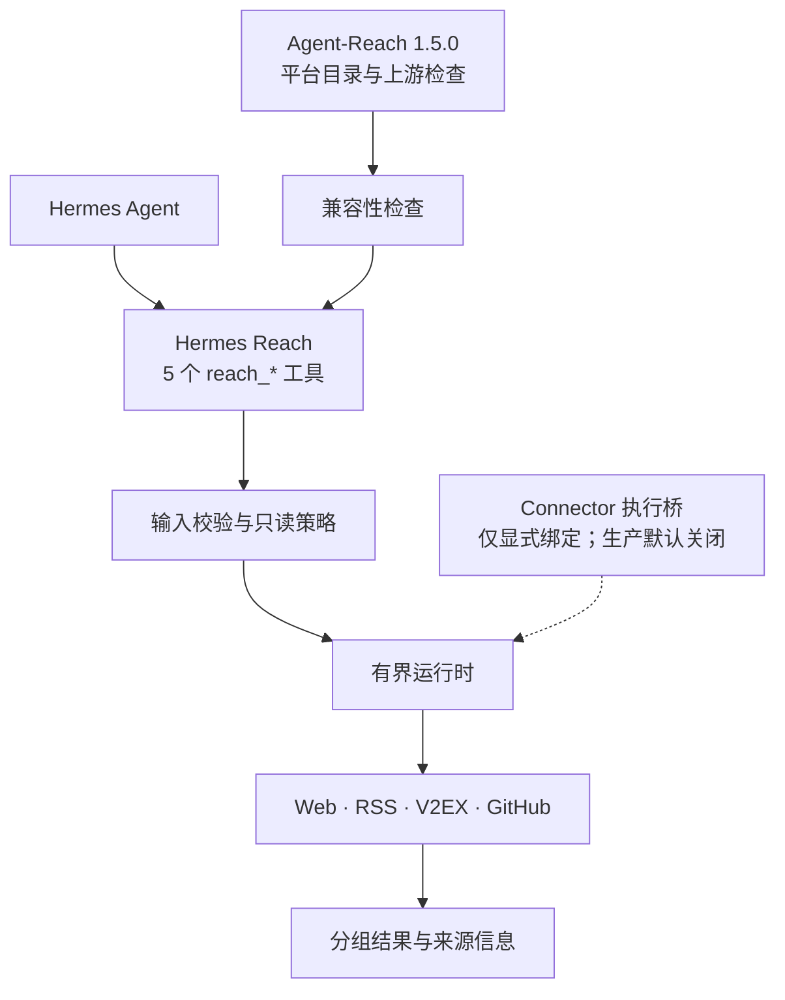
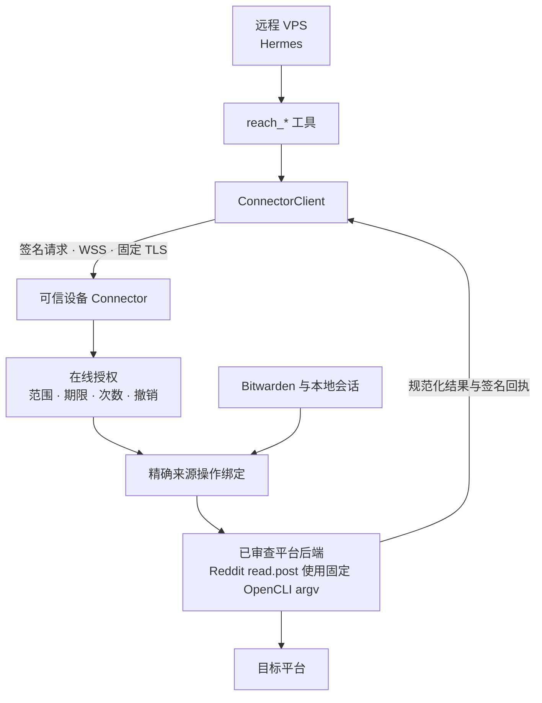

# Hermes Reach

中文 | [English](README_EN.md)

Hermes Reach 让 Hermes 通过一组统一的只读工具读取网页和公开平台，同时为远程 VPS 保留清晰的安全边界。

它参考 [Agent-Reach](https://github.com/Panniantong/Agent-Reach) 支持的平台，通过 [Hermes Agent](https://github.com/NousResearch/hermes-agent) 插件提供搜索、读取、浏览、转写和状态查询。

> [!IMPORTANT]
> 项目目前处于 **Pre-Alpha**。Web、RSS/Atom、V2EX 和 GitHub 已可本地使用。远程 Connector 的精确执行桥和首个 Reddit 只读 executor 已经具备，但默认生产构成没有 Connector 绑定或执行器；Bitwarden、OpenCLI 浏览器会话和真实平台后端仍未启用。

## 它解决什么问题

当 Hermes 运行在 VPS 上时，它需要访问互联网，但不应该同时得到你的平台密码、Cookie 和平台密钥。

Hermes Reach 将这个问题拆成三个部分：

- Hermes 只调用五个稳定的 `reach_*` 工具
- 每个请求都必须指定来源和只读操作
- 需要账号的能力计划在你的可信设备上执行，而不是把凭据复制到 VPS

例如，你可以让 Hermes 搜索 GitHub 仓库、读取网页或整理 RSS 订阅。它不会因此获得发布内容、修改账号或任意调用平台执行后端的能力。

## 如果 Hermes 运行在 VPS 上

Hermes Reach 假设 VPS 可能被完全攻破。安全设计的目标是限制攻击者能得到什么，而不是假设服务器永远可信。

### 今天已经生效

- 工具只支持读取，不提供发布、评论、点赞或其他外部修改操作
- 请求必须点名来源，不会自动访问全部平台
- 运行时限制超时、响应大小、结果数量和分页
- 网页请求会阻止本地地址、私有地址、域名重绑定、代理，以及从 HTTPS 跳回不安全 HTTP
- 没有经过审查的执行后端默认关闭，不会自动选择更宽松的替代方案

### 正在建设的 Connector

未来的 Connector 会运行在你的电脑或其他可信设备上。密码、Cookie、浏览器会话和 Bitwarden 启动令牌留在该设备，VPS 只能使用有期限、有次数限制且可撤销的授权。

Connector 的身份、在线授权、固定 TLS、原终端解锁、VPS 配对、本地可用性快照、隔离 Bitwarden 取密和请求/结果 envelope 已有基础实现。运行时也可以通过**显式注册的精确绑定**将一个已授权操作传到可信设备上的精确 Connector executor。`reddit:read.post` 是第一个经过约束的实现：它只从规范 Reddit URL 提取帖子 ID，再执行固定的 OpenCLI 读取命令。**默认运行时并不注册该绑定，生产 executor 组合也为空；因此普通 `reach_*` 请求不能触发 OpenCLI、浏览器会话、Bitwarden 密钥或真实平台访问，这条远程链路仍不能视为生产可用。**

部署前需要理解的网络、授权、密钥恢复、审计和回滚边界见 [Connector 安全与运维指南](docs/connector-security.md)。该指南描述安全约束，不表示远程执行链路已经可用。

<details>
<summary>查看 Connector 已实现的安全基础</summary>

| 机制 | 作用 |
| --- | --- |
| 设备身份与配对 | 固定可信设备和 VPS 身份，拒绝静默换钥 |
| 原终端（TTY）解锁 | 只允许从前台服务启动时捕获的终端输入密码 |
| SQLite 在线授权 | 原子检查范围、过期、撤销、重放和剩余次数 |
| 安全 WebSocket（WSS）与固定 TLS | 固定证书颁发机构，并校验当前短期证书 |
| 签名回执 | 关联请求、授权版本、执行后端和使用计数 |
| 隔离 Bitwarden 取密 | 在受限子进程中按不透明能力绑定取出单个密钥，不向 VPS 暴露 vault 配置 |
| 请求/结果 envelope | 传输受保护请求，并用签名回执绑定有界规范化结果 |
| VPS 配对与状态快照 | 持久化固定身份、首个授权和不联网的短期健康状态 |
| 前台 ConnectorService | 只在可信设备完成解锁后激活授权服务，并把已授权的精确操作交给显式注入的 executor |

</details>

### 仍然存在的风险

VPS 会看到它获准处理的查询和结果。如果 VPS 在授权有效期内失守，攻击者可能消耗剩余次数。传输层安全协议（TLS）也无法保护已经被攻破的端点。

## 现在可以使用什么

默认安装会注册五个工具，但每个来源是否可用仍以 `reach_status` 的结果为准。

| 状态 | 来源 | 可以做什么 |
| --- | --- | --- |
| 可用 | Web | 读取公开网页 |
| 可用 | RSS/Atom | 读取 feed 和浏览条目 |
| 可用 | V2EX | 浏览热门与节点主题，读取主题和用户 |
| 可用 | GitHub | 搜索仓库和代码，读取仓库、Issue、Pull Request、Actions 和 Releases |
| 已实现但未绑定 | Reddit | 仅 `read.post`；需要可信设备显式注入 OpenCLI executor，默认仍不可用 |
| 需要配置 | Exa、YouTube、Bilibili | 等待经过审查的来源专用执行后端 |
| 规划中 | Twitter/X、小红书、Facebook、Instagram、LinkedIn、雪球、小宇宙，以及 Reddit 其余操作 | 等待逐来源 Connector 审核和凭据隔离 |

五个工具的职责如下：

- `reach_status`：先确认来源和操作是否可用
- `reach_search`：搜索 1 到 5 个明确来源
- `reach_read`：读取一个明确目标
- `reach_browse`：浏览来源原生集合
- `reach_transcribe`：转写受支持的媒体，默认环境暂不可用

无凭据访问不代表无限访问。公共来源仍受平台速率限制、内容可见性和服务条款约束。

## 开始使用

项目尚未发布稳定包。当前流程适用于源码检出，需要 Python 3.11 至 3.13、`uv` 和 Hermes Agent 0.19.x。

在项目根目录安装依赖并启用插件：

```bash
uv sync --all-groups
uv run hermes plugins enable reach
```

Hermes 的第三方插件默认关闭。启用后请重新启动 Hermes，再检查本地能力：

```bash
uv run hermes reach status --json
uv run hermes reach sources --json
uv run hermes reach doctor --json
```

启动会话时加载 `reach:agent-reach` 路由规则，并启用 `reach` 工具组。然后可以直接描述任务：

```text
先检查 GitHub 仓库搜索是否可用，
再查找与 Hermes Agent 插件开发相关的仓库。
```

默认的 `doctor` 只检查本地状态。`hermes reach doctor --upstream` 会额外运行经过限制和脱敏的 Agent-Reach 上游检查。

## 系统如何工作

普通请求目前由 Hermes Reach 自己的运行时和本地适配器执行。Agent-Reach 提供固定版本的平台目录、路由证据、执行后端信息和显式检查；Reach 根据它为 Reddit 选择的 OpenCLI 路线实现了一个固定的 `read.post` executor，但不会在默认运行时中自动组成它。



### Agent-Reach 用到了什么程度

| 已接入 | 尚未接入 |
| --- | --- |
| 15 个平台的目录和执行后端信息 | 普通请求执行引擎 |
| 固定版本和兼容性检查 | 认证平台的 Cookie 和账号会话 |
| 受限、显式触发的上游检查 | 任意执行后端命令或上游安装器 |
| 适配为 Hermes 路由规则的平台语义 | 生产构成中的真实平台 executor（当前为空） |
| Reddit 的 OpenCLI 优先路由已收窄为固定 `read.post` executor | 自动安装 OpenCLI、发现浏览器会话或启用默认 Connector 绑定 |

项目固定使用 Agent-Reach `1.5.0` 和 commit `1494c2ab239e7355a77e7cceaf3271453a1f34b5`。

### 显式组成时的 Connector 路径

精确绑定可以在可信设备中执行经过审查的来源后端。当前 Reddit 切片按照 Agent-Reach 的路由证据调用 OpenCLI，但只允许固定的帖子读取 argv；VPS 不能选择命令、凭据、执行后端、浏览器会话或本地路径。默认生产构成不提供该绑定或后端；每个来源必须单独通过安全设计和测试后才能启用。



## 未来路线图

Roadmap 表示开发顺序，不承诺发布日期。未完成的能力会保持关闭。

| 阶段 | 目标 | 主要工作 |
| --- | --- | --- |
| 已完成 | 稳定公共读取面 | 五个工具、本地适配器、只读策略、Agent-Reach 目录 |
| 已完成 | 安全配对与客户端基础 | ConnectorClient、固定身份与授权、本地可用性快照、签名请求和回执 |
| 已完成 | 隔离凭据并冻结执行协议 | Bitwarden SecretProvider、受保护请求与规范化结果 envelope |
| 已完成 | 精确远程执行桥 | 显式 Connector 适配器、已授权操作交付、回执与重试；默认构成仍为空 |
| 已完成 | 首个来源 executor | Reddit `read.post` 的固定 OpenCLI 读取、封闭 YAML 映射和 WSS 回执测试；默认未绑定 |
| 随后 | 执行更多上游后端 | 逐来源审核的精确绑定、Exa 与媒体后端 |
| 后续 | 支持认证平台和生产运维 | Twitter/X 等平台、一键授权、审计导出、告警、升级与回滚 |

## 开发

项目使用 `uv` 管理环境和锁文件：

```bash
uv sync --all-groups
uv run ruff check src tests
uv run mypy src
uv run pytest
uv build
```

Hermes Reach 当前版本为 `0.1.0a0`，使用 [MIT License](LICENSE)。
