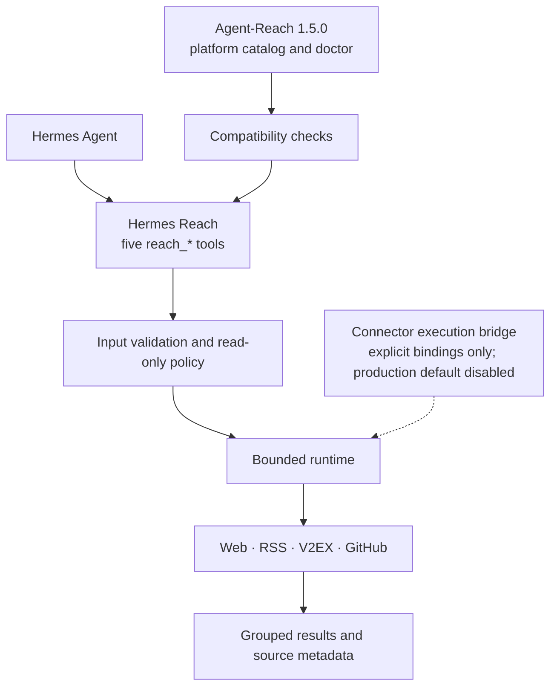
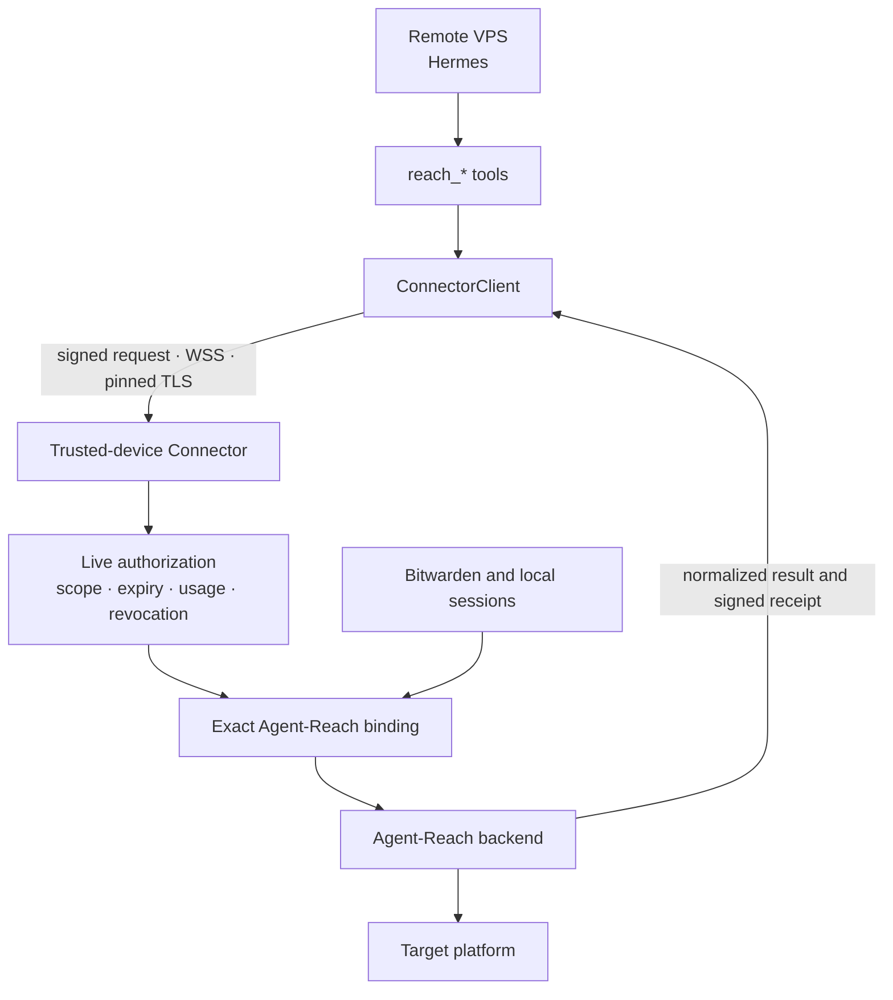

# Hermes Reach

[中文](README.md) | English

Hermes Reach gives Hermes a consistent set of read-only tools for public web and platform data while preserving a clear security boundary for remote VPS hosts.

It uses [Agent-Reach](https://github.com/Panniantong/Agent-Reach) as its upstream capability source and exposes search, read, browse, transcribe, and status operations through a [Hermes Agent](https://github.com/NousResearch/hermes-agent) plugin.

> [!IMPORTANT]
> The project is **pre-alpha**. Local access to Web, RSS/Atom, V2EX, and GitHub works today. The exact remote Connector execution bridge exists, but the default production composition has no Connector bindings or executor; Bitwarden and live Agent-Reach backends remain disabled.

## The problem Hermes Reach solves

When Hermes runs on a virtual private server (VPS), it needs internet access without also receiving your platform passwords, cookies, and access keys.

Hermes Reach separates that problem into three parts:

- Hermes calls only five stable `reach_*` tools
- Every request names an explicit source and read-only operation
- Account-backed operations are intended to run on your trusted device instead of copying credentials to the VPS

For example, Hermes can search GitHub repositories, read a web page, or summarize an RSS feed. Those tasks do not grant permission to publish content, modify an account, or call arbitrary platform backends.

## When Hermes runs on a VPS

Hermes Reach assumes that an attacker may fully compromise the VPS. Its security model limits what the attacker can obtain instead of treating the server as permanently trusted.

### Protections enforced today

- Tools support retrieval only, with no publishing, comments, likes, or other external mutations
- Requests must name a source and never fan out to every platform automatically
- The runtime limits time, response size, result count, and pagination
- Public HTTP requests block local addresses, private addresses, DNS rebinding, proxies, and HTTPS downgrades
- Unreviewed backends remain disabled instead of falling back to a broader execution path

### Connector work in progress

The future Connector runs on your computer or another trusted device. Passwords, cookies, browser sessions, and Bitwarden tokens remain there. The VPS receives only expiring, usage-limited, revocable grants.

The codebase already contains foundations for identity, live authorization, pinned TLS, original-terminal unlock, VPS pairing, local availability snapshots, isolated Bitwarden resolution, and protected-request/result envelopes. The runtime can also deliver one authorized operation to a trusted-device Connector executor through an **explicitly registered exact binding**. **The default runtime registers none of those bindings and the production executor composition is empty; normal `reach_*` requests therefore cannot trigger platform credentials, Bitwarden secrets, or a live Agent-Reach backend, and this remote path is not production-ready.**

Before deployment, read the [Connector security and operations guide](docs/connector-security.md) for the network, grant, key-recovery, audit, and rollback boundaries. The guide documents constraints; it does not mean remote execution is available.

<details>
<summary>View the implemented Connector security foundations</summary>

| Mechanism | Purpose |
| --- | --- |
| Device identity and pairing | Pin trusted-device and VPS identities and reject silent key replacement |
| Original terminal (TTY) unlock | Accept the passphrase only from the terminal captured when the foreground service starts |
| SQLite live authority | Atomically check scope, expiry, revocation, replay, and remaining uses |
| Secure WebSocket (WSS) with pinned TLS | Pin the certificate authority and validate the current short-lived certificate |
| Signed receipts | Correlate requests, grant revisions, backends, and usage accounting |
| Isolated Bitwarden resolution | Resolve one opaque capability binding in a constrained child process without exposing vault configuration to the VPS |
| Request/result envelopes | Transport protected requests and bind bounded normalized results into signed receipts |
| VPS pairing and status snapshots | Persist pinned identity, the first grant, and short-lived no-network health state |
| Foreground ConnectorService | Activate authorization after trusted-device unlock and deliver an authorized exact operation to an explicitly injected executor |

</details>

### Risks that remain

The VPS sees each approved query and result. If an attacker compromises it while a grant remains active, the attacker may consume the remaining uses. Transport Layer Security (TLS) cannot protect an endpoint that is already compromised.

## What you can use today

The default installation registers five tools, but `reach_status` remains authoritative for source and operation availability.

| State | Sources | Available operations |
| --- | --- | --- |
| Available | Web | Read public web pages |
| Available | RSS/Atom | Read feeds and browse entries |
| Available | V2EX | Browse hot and node topics; read topics and users |
| Available | GitHub | Search repositories and code; read repositories, issues, pull requests, Actions, and releases |
| Setup required | Exa, YouTube, and Bilibili | Awaiting reviewed source-specific integrations |
| Planned | Twitter/X, Reddit, Xiaohongshu, Facebook, Instagram, LinkedIn, Xueqiu, and Xiaoyuzhou | Awaiting the Connector and credential isolation |

The five tools have narrow responsibilities:

- `reach_status`: check whether a source and operation are available
- `reach_search`: search 1 to 5 explicit sources
- `reach_read`: read one exact target
- `reach_browse`: browse a source-native collection
- `reach_transcribe`: transcribe supported media; unavailable by default today

Credential-free access is not unlimited. Public sources remain subject to platform rate limits, content visibility, and terms of service.

## Get started

The project does not have a stable package release yet. The current workflow targets a source checkout and requires Python 3.11 through 3.13, `uv`, and Hermes Agent 0.19.x.

Install dependencies and enable the plugin from the repository root:

```bash
uv sync --all-groups
uv run hermes plugins enable reach
```

Hermes disables third-party plugins by default. Restart Hermes after enabling the plugin, then inspect local capabilities:

```bash
uv run hermes reach status --json
uv run hermes reach sources --json
uv run hermes reach doctor --json
```

Load the `reach:agent-reach` skill and enable the `reach` toolset when starting a session. Then describe the retrieval task:

```text
Check whether GitHub repository search is available.
Then find repositories related to Hermes Agent plugin development.
```

The default doctor checks local state only. `hermes reach doctor --upstream` also runs the restricted and redacted Agent-Reach checks.

## How the system works

Normal requests currently run through Hermes Reach's own runtime and local adapters. Agent-Reach supplies only the pinned platform catalog, backend metadata, and explicit doctor.



### How much of Agent-Reach is reused

| Integrated | Not connected |
| --- | --- |
| 15-platform catalog and backend metadata | Normal request execution engine |
| Pinned version and compatibility checks | Cookies and account sessions for authenticated platforms |
| Restricted, explicitly triggered doctor | Arbitrary provider commands or the upstream installer |
| Routing semantics adapted into a Hermes skill | Live platform executors in the production composition (currently empty) |

The project pins Agent-Reach `1.5.0` at commit `1494c2ab239e7355a77e7cceaf3271453a1f34b5`.

### Connector path when explicitly composed

An exact binding can execute a reviewed Agent-Reach backend on the trusted device. The VPS cannot select credentials, providers, browser sessions, or local paths. The default production composition supplies neither the bindings nor live backends; each source must pass its own security design and tests before it can be enabled.



## Roadmap

The roadmap describes development order, not release dates. Incomplete capabilities remain disabled.

| Stage | Goal | Main work |
| --- | --- | --- |
| Complete | Stabilize public retrieval | Five tools, local adapters, read-only policy, Agent-Reach catalog |
| Complete | Secure pairing and client foundation | ConnectorClient, pinned identity and grants, local availability snapshots, signed requests and receipts |
| Complete | Isolate credentials and freeze the execution protocol | Bitwarden SecretProvider, protected-request and normalized-result envelopes |
| Complete | Exact remote execution bridge | Explicit Connector adapters, authorized-operation delivery, receipts, and retries; default composition remains empty |
| Then | Execute upstream backends | Per-source reviewed exact Agent-Reach bindings, Exa, and media backends |
| Later | Support authenticated platforms and production operations | Twitter/X and similar sources, one-step grants, audit export, alerts, upgrades, and rollback |

## Development

The project uses `uv` for its environment and lockfile:

```bash
uv sync --all-groups
uv run ruff check src tests
uv run mypy src
uv run pytest
uv build
```

Hermes Reach is currently version `0.1.0a0` and uses the [MIT License](LICENSE).
