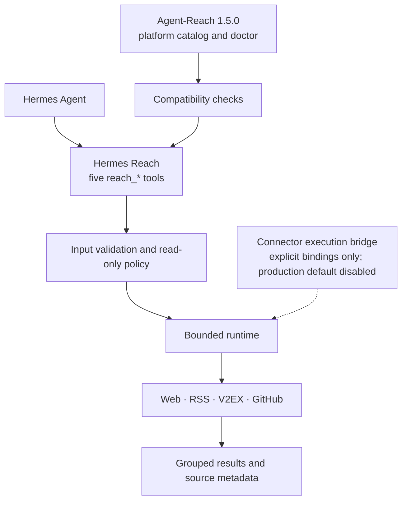
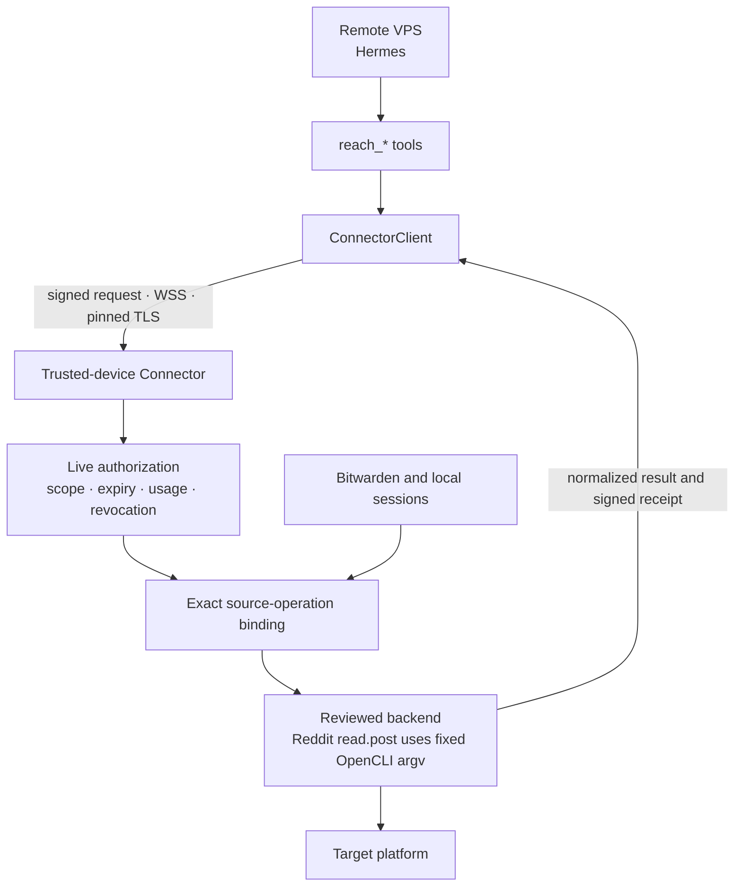

# Hermes Reach

[中文](README.md) | English

Hermes Reach gives Hermes a consistent set of read-only tools for public web and platform data while preserving a clear security boundary for remote VPS hosts.

It uses [Agent-Reach](https://github.com/Panniantong/Agent-Reach) as its upstream capability source and exposes search, read, browse, transcribe, and status operations through a [Hermes Agent](https://github.com/NousResearch/hermes-agent) plugin.

> [!IMPORTANT]
> The project is **pre-alpha**. Local access to Web, RSS/Atom, V2EX, and GitHub works today. The remote Connector can explicitly activate the single Reddit `read.post` OpenCLI path at both ends, while a default installation remains unbound; the Bitwarden credential path and other account-backed platform backends remain disabled.

## The problem Hermes Reach solves

When Hermes runs on a virtual private server (VPS), it needs internet access without also receiving your platform passwords, cookies, and access keys.

Hermes Reach separates that problem into three parts:

- Hermes calls only five stable `reach_*` tools
- Every request names an explicit source and read-only operation
- Account-backed operations are intended to run on your trusted device instead of copying credentials to the VPS

For example, Hermes can search GitHub repositories, read a web page, or summarize an RSS feed. Those tasks do not grant permission to publish content, modify an account, or call arbitrary platform backends.

## When Hermes runs on a VPS

Hermes Reach assumes that an attacker may fully compromise the VPS. Its security model limits what the attacker can obtain instead of treating the server as permanently trusted.

### Protections enforced today

- Tools support retrieval only, with no publishing, comments, likes, or other external mutations
- Requests must name a source and never fan out to every platform automatically
- The runtime limits time, response size, result count, and pagination
- Public HTTP requests block local addresses, private addresses, DNS rebinding, proxies, and HTTPS downgrades
- Unreviewed backends remain disabled instead of falling back to a broader execution path

### Explicit Connector activation (pre-alpha)

The Connector runs on your computer or another trusted device. Passwords, cookies, browser sessions, and Bitwarden tokens remain there. The VPS receives only expiring, usage-limited, revocable grants.

The codebase contains identity, live authorization, pinned TLS, original-terminal unlock, VPS pairing, local availability snapshots, isolated Bitwarden resolution, and protected-request/result envelopes. `reddit:read.post` is the first exact binding that can be activated explicitly: it extracts a post ID from a canonical Reddit URL and invokes one fixed OpenCLI read command. The trusted device must attest the executable through `--reddit-opencli`, and the VPS must explicitly point to paired local state containing the exact `reddit:read.post:public` grant. Either missing gate fails closed, and a default installation never discovers or runs OpenCLI.

Before deployment, read the [Connector security and operations guide](docs/connector-security.md) for the network, grant, key-recovery, audit, and rollback boundaries. This activation path remains pre-alpha and does not authorize a generic command, credential, or platform capability.

<details>
<summary>View the implemented Connector security foundations</summary>

| Mechanism | Purpose |
| --- | --- |
| Device identity and pairing | Pin trusted-device and VPS identities and reject silent key replacement |
| Original terminal (TTY) unlock | Accept the passphrase only from the terminal captured when the foreground service starts |
| SQLite live authority | Atomically check scope, expiry, revocation, replay, and remaining uses |
| Secure WebSocket (WSS) with pinned TLS | Pin the certificate authority and validate the current short-lived certificate |
| Signed receipts | Correlate requests, grant revisions, backends, and usage accounting |
| Isolated Bitwarden resolution | Resolve one opaque capability binding in a constrained child process without exposing vault configuration to the VPS |
| Request/result envelopes | Transport protected requests and bind bounded normalized results into signed receipts |
| VPS pairing and status snapshots | Persist pinned identity, the first grant, and short-lived no-network health state |
| Foreground ConnectorService | Activate authorization after trusted-device unlock and deliver an authorized exact operation to an explicitly injected executor |

</details>

### Risks that remain

The VPS sees each approved query and result. If an attacker compromises it while a grant remains active, the attacker may consume the remaining uses. Transport Layer Security (TLS) cannot protect an endpoint that is already compromised.

## What you can use today

The default installation registers five tools, but `reach_status` remains authoritative for source and operation availability.

| State | Sources | Available operations |
| --- | --- | --- |
| Available | Web | Read public web pages |
| Available | RSS/Atom | Read feeds and browse entries |
| Available | V2EX | Browse hot and node topics; read topics and users |
| Available | GitHub | Search repositories and code; read repositories, issues, pull requests, Actions, and releases |
| Explicitly configurable | Reddit | `read.post` only; requires activation on both the trusted device and VPS and remains unavailable by default |
| Setup required | Exa, YouTube, and Bilibili | Awaiting reviewed source-specific integrations |
| Planned | Twitter/X, Xiaohongshu, Facebook, Instagram, LinkedIn, Xueqiu, Xiaoyuzhou, and all other Reddit operations | Awaiting per-source Connector review and credential isolation |

The five tools have narrow responsibilities:

- `reach_status`: check whether a source and operation are available
- `reach_search`: search 1 to 5 explicit sources
- `reach_read`: read one exact target
- `reach_browse`: browse a source-native collection
- `reach_transcribe`: transcribe supported media; unavailable by default today

Credential-free access is not unlimited. Public sources remain subject to platform rate limits, content visibility, and terms of service.

## Get started

The project does not have a stable package release yet. The current workflow targets a source checkout and requires Python 3.11 through 3.13, `uv`, and Hermes Agent 0.19.x.

Install dependencies and enable the plugin from the repository root:

```bash
uv sync --all-groups
uv run hermes plugins enable reach
```

Hermes disables third-party plugins by default. Restart Hermes after enabling the plugin, then inspect local capabilities:

```bash
uv run hermes reach status --json
uv run hermes reach sources --json
uv run hermes reach doctor --json
```

Load the `reach:agent-reach` skill and enable the `reach` toolset when starting a session. Then describe the retrieval task:

```text
Check whether GitHub repository search is available.
Then find repositories related to Hermes Agent plugin development.
```

The default doctor checks local state only. `hermes reach doctor --upstream` also runs the restricted and redacted Agent-Reach checks.

### Enable Reddit `read.post`

Initialize state on the trusted device, then start the only permitted OpenCLI executor in the foreground:

```bash
uv run hermes reach connector init \
  --role connector \
  --state-directory /absolute/connector-state

uv run hermes reach connector serve \
  --state-directory /absolute/connector-state \
  --bind 100.64.0.10 \
  --port 8765 \
  --reddit-opencli /absolute/path/to/opencli
```

`serve` displays the canonical path, SHA-256, and exact scope on the original terminal and accepts only the literal confirmation `enable`. After confirmation, enter `unlock` at the `Connector>` prompt on that same original terminal and supply the Connector passphrase; the listener starts only after this unlock succeeds. Keep the foreground process running, then initialize and pair the VPS:

```bash
uv run hermes reach connector init \
  --role vps \
  --state-directory /absolute/vps-state

uv run hermes reach connector pair \
  --state-directory /absolute/vps-state \
  --connector wss://100.64.0.10:8765 \
  --device-label hermes-vps \
  --scope reddit:read.post:public
```

While `pair` waits, enter `pending` at the trusted device's `Connector>` prompt. After comparing both displays, enter `approve <pairing-id>` and type the literal `approve` at its confirmation prompt. Once pairing completes, `lock` stops the trusted listener; leave it unlocked to execute requests.

Finally, start the Hermes process on the VPS with the same absolute state directory:

```bash
HERMES_REACH_VPS_STATE_DIRECTORY=/absolute/vps-state hermes ...
```

This environment value is only a pointer to owner-only local paired state. It is not a secret and cannot widen the grant. Pairing or local state changes require a Hermes restart; server-side revocation takes effect on the next request. A valid grant normally reports `degraded` until the first signed success changes it to `available`. If the VPS recently received signed `backend_unbound`, the local failure snapshot can take up to about 60 seconds after the trusted binding is repaired to return to retryable `degraded`. See the [Connector security and operations guide](docs/connector-security.md) for the full procedure.

## How the system works

Normal requests currently run through Hermes Reach's own runtime and local adapters. Agent-Reach supplies the pinned platform catalog, routing evidence, backend metadata, and explicit doctor. Reach uses its OpenCLI-first Reddit route as evidence for one fixed `read.post` executor. It is not composed into the default runtime; only the explicit two-sided activation above adds the exact binding.



### How much of Agent-Reach is reused

The 15-platform catalog, backend metadata, version compatibility, and
restricted doctor come directly from Agent-Reach. Normal requests do not pass
through an Agent-Reach execution path. Of 26 operations marked implemented,
none directly reuses Agent-Reach execution, 9 thinly wrap the same external
backend, 11 use a Hermes-native replacement mechanism, and 6 reimplement
platform logic. Another 37 operations remain unimplemented. Only 16 of the 26
have a concrete retrieval implementation; the 8 YouTube/Bilibili rows and 2
Exa rows are still unbound audited interfaces, not production executors.

The boundary is therefore frozen: Hermes Reach owns protocol, authorization,
safe invocation, normalization, bounds, redaction, receipts, and audit.
Platform knowledge, backend selection, and retrieval implementation belong to
Agent-Reach or its pinned backend. New platform adapters are paused, and a
native replacement or reimplementation requires a separately approved
exception. See the full matrix, accounting rules, and migration priorities in
the [Agent-Reach reuse boundary](docs/agent-reach-reuse-boundary.md).

The project pins Agent-Reach `1.5.0` at commit `1494c2ab239e7355a77e7cceaf3271453a1f34b5`.

### Connector path when explicitly composed

An exact binding can execute a reviewed source backend on the trusted device. The current Reddit slice follows Agent-Reach routing evidence but permits only a fixed OpenCLI post-read argv; the VPS cannot select commands, credentials, providers, browser sessions, or local paths. The default composition supplies no binding; it is added only when `--reddit-opencli` and paired VPS state are both present. Every additional source must still pass its own security design and tests.



## Roadmap

The roadmap describes development order, not release dates. Incomplete capabilities remain disabled.

| Stage | Goal | Main work |
| --- | --- | --- |
| Complete | Stabilize public retrieval | Five tools, local adapters, read-only policy, Agent-Reach catalog |
| Complete | Secure pairing and client foundation | ConnectorClient, pinned identity and grants, local availability snapshots, signed requests and receipts |
| Complete | Isolate credentials and freeze the execution protocol | Bitwarden SecretProvider, protected-request and normalized-result envelopes |
| Complete | Exact remote execution bridge | Explicit Connector adapters, authorized-operation delivery, receipts, and retries; default composition remains empty |
| Complete | First source executor | Fixed OpenCLI read, closed YAML mapping, and WSS receipt test for Reddit `read.post`; unbound by default |
| Complete | Explicit two-sided production composition | Attest and confirm OpenCLI on the trusted device; build the sole Reddit adapter from owner-only paired VPS state |
| Complete | Correct the P0 reuse boundary | Audit all 63 operations; approve bounded Web/GitHub exceptions, remove generic Exa activation, and freeze evidence in a machine-readable manifest |
| Now | Resolve RSS/V2EX P1 drift | Prefer fixed upstream callables; record time-bounded exceptions where the safety boundary cannot be preserved, and add no platform retrieval logic |
| Then | Execute more upstream backends | Add only direct reuse or thin wrappers around pinned upstream backends |
| Later | Support authenticated platforms and production operations | Twitter/X and similar sources, one-step grants, audit export, alerts, upgrades, and rollback |

## Development

The project uses `uv` for its environment and lockfile:

```bash
uv sync --all-groups
uv run ruff check src tests
uv run mypy src
uv run pytest
uv build
```

Hermes Reach is currently version `0.1.0a0` and uses the [MIT License](LICENSE).
