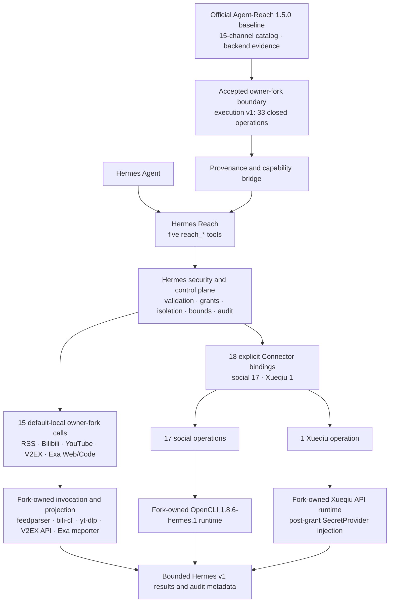
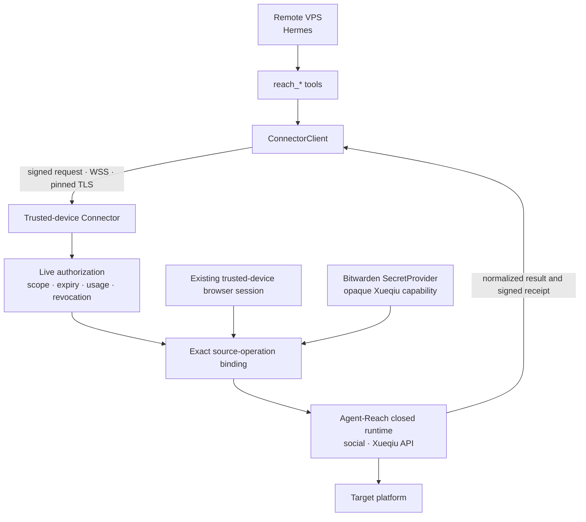

# Hermes Reach

[中文](README.md) | English

Hermes Reach gives Hermes a consistent set of read-only tools for public web and platform data while preserving a clear security boundary for remote VPS hosts.

It pins an [owner fork](https://github.com/izumi0uu/Agent-Reach) based on a
reviewed official [Agent-Reach](https://github.com/Panniantong/Agent-Reach)
baseline. The official baseline supplies channel, backend-routing, and
compatibility evidence; the fork's structured execution v1 currently carries
two RSS, four Bilibili, three YouTube, four V2EX, one Exa Web, seven Reddit,
four Facebook, four Instagram, one Twitter, one Xiaohongshu, one
Xueqiu, and one Exa Code operation. Hermes Reach then exposes
search, read, browse, transcribe, and status operations through a
[Hermes Agent](https://github.com/NousResearch/hermes-agent) plugin.

> [!IMPORTANT]
> The project is **pre-alpha**. The frozen boundary has 33 direct owner-fork
> operations: RSS 2, Bilibili 4, YouTube 3, V2EX 4, Exa Web/Code 2, 17
> social and one Xueqiu operation. The first 13 are locally
> available by default. Exa Web and Code have
> default-local binding surface but is composed only after the operator
> supplies the complete Node/mcporter/config
> artifact attestation; otherwise it remains `setup_required`. The remote
> Connector can explicitly activate 18 fork-owned operations through two-sided
> configuration, while default Connector composition remains empty. Web,
> GitHub, LinkedIn, and other unaudited operations remain planned and
> unavailable. The fork does not make the other 30 catalog operations
> executable. PR #6's current reviewed 33-descriptor candidate is
> `ee200e7160c4b093a2ba0fcee9f2a6842aefe20d` (tree
> `56883c0872bed94050660b16d1ade2e46f73fef9`). This branch pins it exactly,
> but it remains unmerged, untagged, and non-publishable. Its 35-descriptor
> parent is retained only as LinkedIn rejection evidence.

## The problem Hermes Reach solves

When Hermes runs on a virtual private server (VPS), it needs internet access without also receiving your platform passwords, cookies, and access keys.

Hermes Reach separates that problem into three parts:

- Hermes calls only five stable `reach_*` tools
- Every request names an explicit source and read-only operation
- Account-backed operations are intended to run on your trusted device instead of copying credentials to the VPS

For example, Hermes can summarize an RSS feed, search Bilibili videos, or read YouTube subtitles. Those tasks do not grant permission to publish content, modify an account, or call arbitrary platform backends.

## When Hermes runs on a VPS

Hermes Reach assumes that an attacker may fully compromise the VPS. Its security model limits what the attacker can obtain instead of treating the server as permanently trusted.

### Protections enforced today

- Tools support retrieval only, with no publishing, comments, likes, or other external mutations
- Requests must name a source and never fan out to every platform automatically
- The runtime limits time, response size, result count, and pagination
- Public HTTP retrieval used by RSS blocks local/private addresses, DNS rebinding, proxies, and HTTPS downgrades
- Unreviewed backends remain disabled instead of falling back to a broader execution path

### Explicit Connector activation (pre-alpha)

The Connector runs on your computer or another trusted device. Passwords, cookies, browser sessions, and Bitwarden tokens remain there. The VPS receives only expiring, usage-limited, revocable grants.

The codebase contains identity, live authorization, pinned TLS,
original-terminal unlock, VPS pairing, local availability snapshots, isolated
Bitwarden resolution, and protected-request/result envelopes. The frozen
boundary can explicitly activate 17 social and one Xueqiu binding.
Agent-Reach owns every platform command, HTTP endpoint, parse, and source-native
projection; Hermes transports a closed request, validates the result, and
creates the receipt. The trusted device must attest each exact backend closure.
Xueqiu resolves its Cookie only after authorization through Connector
SecretProvider; the VPS receives only an opaque capability ID. Either missing
gate fails closed. A default installation never discovers or runs these
backends and never copies cookies or a browser session to the VPS.
LinkedIn people/jobs remains planned and unavailable because of query logging,
diagnostic persistence, service-identity binding, and duplicate-submission risk.

Before deployment, read the [Connector security and operations guide](docs/connector-security.md) for the network, grant, key-recovery, audit, and rollback boundaries. This activation path remains pre-alpha and does not authorize a generic command, credential, or platform capability.

<details>
<summary>View the implemented Connector security foundations</summary>

| Mechanism | Purpose |
| --- | --- |
| Device identity and pairing | Pin trusted-device and VPS identities and reject silent key replacement |
| Original terminal (TTY) unlock | Accept the passphrase only from the terminal captured when the foreground service starts |
| SQLite live authority | Atomically check scope, expiry, revocation, replay, and remaining uses |
| Secure WebSocket (WSS) with pinned TLS | Pin the certificate authority and validate the current short-lived certificate |
| Signed receipts | Correlate requests, grant revisions, backends, and usage accounting |
| Isolated Bitwarden resolution | Resolve one opaque capability binding in a constrained child process without exposing vault configuration to the VPS |
| Request/result envelopes | Transport protected requests and bind bounded normalized results into signed receipts |
| VPS pairing and status snapshots | Persist pinned identity, the first grant, and short-lived no-network health state |
| Foreground ConnectorService | Activate authorization after trusted-device unlock and deliver an authorized exact operation to an explicitly injected executor |

</details>

### Risks that remain

The VPS sees each approved query and result. If an attacker compromises it while a grant remains active, the attacker may consume the remaining uses. Transport Layer Security (TLS) cannot protect an endpoint that is already compromised.

## What you can use today

The default installation registers five tools, but `reach_status` remains authoritative for source and operation availability.

| State | Sources | Available operations |
| --- | --- | --- |
| Locally available | RSS/Atom | Read feeds and browse entries through owner-fork execution v1 with fixed `feedparser` provenance |
| Locally available | Bilibili | Search/read videos and browse hot/rank through owner-fork execution v1 with fixed `bili-cli` provenance |
| Locally available | YouTube | Search, video reads, and subtitles all use owner-fork execution v1 with fixed `yt-dlp==2026.7.4` plus the pinned EJS/Deno closure |
| Locally available | V2EX | Browse hot/node topics and read topics/replies/users through owner-fork execution v1 with a fixed public API and bounded transport |
| Local artifact setup required | Exa | `search.web` and `search.code`; the executors are composed after a complete well-formed Node/mcporter/config path-and-digest declaration, then revalidate actual artifacts at execution |
| Explicitly configurable | Reddit | Seven catalog operations execute through the owner-fork OpenCLI runtime on the trusted Connector and remain unavailable by default |
| Explicitly configurable | Facebook | Four catalog operations; Feed and Groups require exact `account_visible` grants and remain unavailable by default |
| Explicitly configurable | Instagram | Four catalog operations; Explore requires an exact `account_visible` grant and remains unavailable by default |
| Explicitly configurable | Twitter/X and Xiaohongshu | One search operation each through the same fork-owned social closure; unavailable by default |
| Explicitly configurable | Xueqiu | `search.stocks`; the Cookie is injected only by the trusted Connector SecretProvider; unavailable by default |
| Implemented, unbound | YouTube | `read.comments` remains `setup_required` and performs no backend call |
| Planned, unavailable | Web, GitHub, LinkedIn, Xiaoyuzhou, and remaining catalog operations | LinkedIn people/jobs hit the frozen stop condition; other operations await an official callable or a safe exact Agent-Reach-selected backend |

The five tools have narrow responsibilities:

- `reach_status`: check whether a source and operation are available
- `reach_search`: search 1 to 5 explicit sources
- `reach_read`: read one exact target
- `reach_browse`: browse a source-native collection
- `reach_transcribe`: transcribe supported media; unavailable by default today

Credential-free access is not unlimited. Public sources remain subject to platform rate limits, content visibility, and terms of service.

## Get started

The project does not have a stable release. The approved first public channel
is GitHub Pre-releases and requires Python 3.11 through 3.13, `uv`, GitHub CLI,
and Hermes Agent 0.19.x.

### Install from a GitHub pre-release

The workflow uploads exactly three assets: the wheel, sdist, and `SHA256SUMS`.
GitHub separately renders generated `Source code (zip)` and
`Source code (tar.gz)` tag snapshots. They are not workflow-uploaded assets and
are not covered by `SHA256SUMS` or this workflow's attestations. After
`v0.1.0a1` appears in GitHub Releases, download the three workflow assets from
any empty directory:

```bash
RELEASE_TAG=v0.1.0a1
RELEASE_DIR="hermes-reach-${RELEASE_TAG}"
gh release download "$RELEASE_TAG" \
  --repo izumi0uu/hermes-reach \
  --dir "$RELEASE_DIR"

gh attestation verify \
  "$RELEASE_DIR/hermes_reach-0.1.0a1-py3-none-any.whl" \
  --repo izumi0uu/hermes-reach \
  --signer-workflow izumi0uu/hermes-reach/.github/workflows/release.yml
gh attestation verify \
  "$RELEASE_DIR/hermes_reach-0.1.0a1.tar.gz" \
  --repo izumi0uu/hermes-reach \
  --signer-workflow izumi0uu/hermes-reach/.github/workflows/release.yml
```

The two commands verify the wheel and sdist separately and restrict the signer
to this repository's reviewed release workflow. `SHA256SUMS` itself is not an
attestation subject; it only records the expected digests for the two
distributions. Then verify those digests. On macOS:

```bash
cd "$RELEASE_DIR"
shasum -a 256 --check SHA256SUMS
cd ..
```

On GNU/Linux, replace the second line with
`sha256sum --check SHA256SUMS`. On Windows, compare
`Get-FileHash -Algorithm SHA256` results with the manifest. The attestation
checks authenticate each distribution's workflow provenance; SHA-256 only
detects changed bytes and does not authenticate the publisher by itself.

Install the wheel into the same Python environment that actually runs Hermes.
The paths below are placeholders; do not substitute whichever Python happens
to be active in the current shell:

```bash
HERMES_PYTHON=/absolute/path/to/hermes-environment/bin/python
HERMES_BIN=/absolute/path/to/hermes-environment/bin/hermes

uv pip install \
  --python "$HERMES_PYTHON" \
  "$RELEASE_DIR/hermes_reach-0.1.0a1-py3-none-any.whl"
uv pip check --python "$HERMES_PYTHON"

"$HERMES_BIN" plugins enable reach --no-allow-tool-override
```

Windows environments normally use `Scripts\python.exe` and
`Scripts\hermes.exe` from the same environment. Installing the wheel does not
enable it, and the explicit command above does not grant tool override
authority. Start a new Hermes session after enabling, then inspect local
capabilities:

```bash
"$HERMES_BIN" reach status --json
"$HERMES_BIN" reach sources --json
"$HERMES_BIN" reach doctor --json
```

This pre-release wheel is not an offline dependency bundle. Installation needs
Git, PyPI network access, and GitHub HTTPS access for the exact
`izumi0uu/Agent-Reach` owner-fork commit. It resolves all other
declared dependencies without reading this repository's `uv.lock`. Before
release, that commit must have an immutable integration tag protected from
movement and deletion so old installs and rollback remain reachable. The tag
is only a recovery reference, not a dependency selector; the exact commit
remains authoritative.

To roll back a wheel installation, disable it first, start a new session
without Reach, then uninstall it through the package manager for that same
Python environment:

```bash
"$HERMES_BIN" plugins disable reach
uv pip uninstall --python "$HERMES_PYTHON" hermes-reach
uv pip check --python "$HERMES_PYTHON"
```

### Develop from a source checkout

Install dependencies and enable the plugin from the repository root:

```bash
uv sync --all-groups
uv run hermes plugins enable reach --no-allow-tool-override
```

Hermes disables third-party plugins by default. Start a new Hermes session after enabling the plugin, then inspect local capabilities:

```bash
uv run hermes reach status --json
uv run hermes reach sources --json
uv run hermes reach doctor --json
```

Source-environment rollback also starts by disabling the plugin and starting a
new session:

```bash
uv run hermes plugins disable reach
```

Then uninstall it from the default project environment, `.venv`:

```bash
uv pip uninstall --python .venv/bin/python hermes-reach
```

On Windows, replace the interpreter path with `.venv\Scripts\python.exe`.

Hermes' own `plugins remove`, `plugins rm`, and
`plugins uninstall` commands remove directory plugins under
`HERMES_HOME/plugins`; they do not uninstall pip wheels. Disabling before
uninstalling also prevents a stale enabled entry from activating a future
installation with the same plugin key. Running `uv sync` again in the source
checkout reinstalls the current project; leave it disabled when the goal is to
keep the installed plugin inactive.

Load the `reach:agent-reach` skill and enable the `reach` toolset when starting a session. Then describe the retrieval task:

```text
Check whether YouTube subtitle reading is available.
Then read Chinese subtitles from the specified video.
```

The default doctor checks local state only. `hermes reach doctor --upstream` also runs the restricted and redacted Agent-Reach checks.

### Enable Exa Web search

Exa Web uses no API key and never discovers Node/mcporter from PATH, npm,
editor state, or user configuration. First provision a reviewed
`mcporter==0.12.3` artifact closure and credential-free sterile configuration,
then provide all seven values in the environment that starts Hermes:

```bash
export HERMES_REACH_EXA_NODE_EXECUTABLE=/absolute/path/to/node
export HERMES_REACH_EXA_NODE_SHA256=<64-lowercase-hex>
export HERMES_REACH_EXA_MCPORTER_ROOT=/absolute/path/to/mcporter
export HERMES_REACH_EXA_MCPORTER_CLI=/absolute/path/to/mcporter/dist/cli.js
export HERMES_REACH_EXA_MCPORTER_TREE_SHA256=<64-lowercase-hex>
export HERMES_REACH_EXA_CONFIG_PATH=/absolute/path/to/sterile-config.json
export HERMES_REACH_EXA_CONFIG_SHA256=<64-lowercase-hex>
```

This repository neither installs the artifacts nor ships reusable production
digests. The values must come from the operator's review record for the actual
deployed closure; do not improvise a set from an unaudited global installation.
This version also has no automated provisioning or attestation generator, so
the default `setup_required` state is intentional.
With all seven values absent, partial, or malformed, `exa:search.web` and
`exa:search.code` are
`setup_required` and does not probe or execute a backend. Start a new Hermes
process after configuration and inspect composition with `reach status`.
`available` proves only that the declaration is complete and well formed; the
isolated worker revalidates actual files, digests, versions, and the dependency
tree on first execution. Hermes excludes the query from receipts and audit,
but Exa receives it and may retain it. Web and Code use distinct fixed MCP
endpoints, methods, and result grammars and cannot fall back to each other.

### Enable social and Xueqiu operations

Initialize state on the trusted device, then start the complete OpenCLI social
executor in the foreground:

```bash
uv run hermes reach connector init \
  --role connector \
  --state-directory /absolute/connector-state

uv run hermes reach connector serve \
  --state-directory /absolute/connector-state \
  --bind 100.64.0.10 \
  --port 8765 \
  --opencli-social-node /absolute/path/to/node \
  --opencli-social-root /absolute/opencli-production-prefix \
  --opencli-social-cli /absolute/opencli-production-prefix/node_modules/@jackwener/opencli/dist/src/main.js \
  --opencli-social-session-home /absolute/trusted-session-home \
  --xueqiu-binding-manifest /absolute/owner-only-xueqiu-binding.json
```

All four `--opencli-social-*` arguments must be present or all four must be
absent. `serve` displays the Node SHA-256, complete OpenCLI tree SHA-256, and
the exact `opencli/1.8.6-hermes.1` backend identity plus all 17 scopes on the
original terminal, and accepts only the literal confirmation `enable`. Xueqiu
accepts only an owner-only `--xueqiu-binding-manifest`; the manifest contains no Cookie,
secret value, BWS bootstrap/access token, provider selection, or injection
target. It contains exactly `protocol_version`, `capability_id`, `project_id`,
`selector`, `profile_home`, `bws_sha256`, and `server_url`; those locators stay
on the trusted device and never enter TTY output, VPS wire data, receipts,
audit, or logs. All configured groups share one TTY
confirmation, which does not display local paths or secret locators. After
confirmation, enter `unlock` at the `Connector>` prompt on that same original
terminal and supply the Connector passphrase; the
listener starts only after this unlock succeeds. Keep the foreground process
running, then initialize the VPS and pair only the exact scopes it needs. This
example grants one public read and one account-visible read:

LinkedIn has no activation arguments. People/jobs search remains planned and
unavailable because MCP 4.14.0 writes query-bearing URLs at `WARNING`, persists
query diagnostics on error, cannot bind wheel/log-level/12-second-timeout
evidence to the existing service identity, and can combine `section_errors`
with retry behavior to duplicate a submission. See the
[LinkedIn stop-condition decision](docs/agent-reach-decisions/linkedin-scraper-mcp-4.14.0.md).

```bash
uv run hermes reach connector init \
  --role vps \
  --state-directory /absolute/vps-state

uv run hermes reach connector pair \
  --state-directory /absolute/vps-state \
  --connector wss://100.64.0.10:8765 \
  --device-label hermes-vps \
  --scope reddit:read.post:public \
  --scope instagram:browse.explore:account_visible
```

While `pair` waits, enter `pending` at the trusted device's `Connector>` prompt. After comparing both displays, enter `approve <pairing-id>` and type the literal `approve` at its confirmation prompt. Once pairing completes, `lock` stops the trusted listener; leave it unlocked to execute requests.

Finally, start the Hermes process on the VPS with the same absolute state directory:

```bash
HERMES_REACH_VPS_STATE_DIRECTORY=/absolute/vps-state hermes ...
```

This environment value is only a pointer to owner-only local paired state. It
is not a secret and cannot widen the grant. Pairing or local state changes
require a Hermes restart; server-side revocation takes effect on the next
request. A valid grant normally reports `degraded` until the first signed
success changes it to `available`. Within one signed invocation, only typed
transient, unavailable, or deadline results permit at most one internal retry.
Both attempts share the original 20-second deadline and do not consume the
grant twice. If the VPS recently received signed `backend_unbound`, the local
failure snapshot can take up to about 60 seconds after the trusted binding is
repaired to return to retryable `degraded`. See the
[Connector security and operations guide](docs/connector-security.md) for the
full procedure.

## How the system works

Hermes Reach integrates the exact pinned Agent-Reach owner fork through
`hermes_reach.register`. The official baseline supplies the 15-channel
registry, backend-routing evidence, compatibility metadata, and restricted
doctor. Fork execution v1 currently owns two RSS, four Bilibili, three YouTube,
four V2EX, two Exa, and 18 Connector-only operations. Hermes Reach supplies
the five closed tools, security policy, host capabilities, Connector,
normalization, and audit. All current platform execution is owned by the exact
fork rather than a Hermes platform runtime.



### How much of Agent-Reach is reused

The 15-channel registry, backend metadata, and official compatibility baseline
come from official Agent-Reach. Owner-fork execution v1 directly runs two RSS,
four Bilibili, three YouTube, four V2EX, one Exa Web, and 15 OpenCLI social
operations, plus four accepted search operations. The Hermes product catalog
has 63 read-only operations: 34 are marked implemented and 29 are planned.
Thirty-three have concrete executors, all through the owner-fork runtime.
Fifteen binding surfaces are default-local and 18 are Connector-only. Exa's executors are implemented but are not
composed without complete artifact evidence, so its normal state is
`setup_required`. One additional contract, `youtube:read.comments`, is
implemented but unbound and is not counted as a concrete executor.

Official Agent-Reach 1.5.0 has no unified structured operation execution API,
so the number of direct official runtime calls remains zero. The reviewed owner
fork adds only operation-scoped execution and currently owns exactly 33 closed
calls; it is not a general 15-channel runtime. The 13 former Hermes
platform implementations for Web, GitHub, and V2EX remain disabled; V2EX is
available again only through the new fork descriptors. Hermes-native and
reimplementation exceptions are both zero.

Hermes Reach owns protocol, authorization, host capabilities, safe invocation,
normalization, bounds, redaction, receipts, and audit. Invocation and
source-native projection for all 33 direct operations belong to the exact
owner fork. Social commands and Xueqiu HTTP semantics exist only in that fork;
LinkedIn has no executable path. See
[Agent-Reach as a Hermes plugin](docs/agent-reach-plugin-boundary.md) for the
canonical architecture and the
[Agent-Reach reuse boundary](docs/agent-reach-reuse-boundary.md) for the
operation matrix and reactivation gates.

The project pins Agent-Reach `1.5.0`; the reviewed official base is
`b4d52c46c9113cb0f653d6df4cf71ebadf4930ac` and the execution protocol is
`v1`. The complete 63-row state lives in the
[operation ledger](docs/agent-reach-operation-ledger.json); the 33 descriptors
do not claim execution support for the other 30 rows. The current exact
owner-fork candidate pin is
`ee200e7160c4b093a2ba0fcee9f2a6842aefe20d`, tree
`56883c0872bed94050660b16d1ade2e46f73fef9`. It is PR #6's reviewed
33-descriptor head, but remains unmerged, untagged, and non-publishable. Its
pre-freeze parent `7bc42839d3dd290e4af93b24e0b03b738cff0ffa`, tree
`382557e0bec76819f0633f31895580a0f549b6bd`, contains the rejected LinkedIn
descriptors and remains historical evidence only. Rolling back to
`281dc3352c63cdb644f02e028cc5d645c279954a` disables the four accepted search
batch without a protocol, grant, Connector, database, receipt, or audit
migration. Earlier integration history remains in the
[release guide](docs/releasing.md). Recovery tags are historical references,
not dependency selectors; the exact commit remains authoritative.

### Connector path when explicitly composed

An exact binding can execute a reviewed source backend on the trusted device.
The 17 social operations call the fork's closed social runtime, and Xueqiu
resolves one opaque SecretProvider capability only after authorization. The VPS cannot select commands, endpoints,
methods, credentials, execution backends, browser sessions, local paths, or
scopes. The default composition supplies none of these bindings. Each group is
composed only when its complete artifacts or manifest, one literal `enable`
confirmation, and exact grants in paired VPS state are all present.



## Roadmap

The roadmap describes development order, not release dates. Incomplete capabilities remain disabled.

| Stage | Goal | Main work |
| --- | --- | --- |
| Complete | Stabilize public retrieval | Five tools, the 63-operation Hermes product catalog, read-only policy, and official Agent-Reach registry bridge |
| Complete | Secure pairing and client foundation | ConnectorClient, pinned identity and grants, local availability snapshots, signed requests and receipts |
| Complete | Isolate credentials and freeze the execution protocol | Bitwarden SecretProvider, protected-request and normalized-result envelopes |
| Complete | Exact remote execution bridge | Explicit Connector adapters, authorized-operation delivery, receipts, and retries; default composition remains empty |
| Complete | First Connector executor | The early Reddit `read.post` wrapper proved the WSS, grant, and receipt boundary and has now been replaced by the fork-owned social runtime |
| Complete | Explicit two-sided production composition | Attest Node, OpenCLI, and session capability and confirm on the trusted device; build exact social adapters from owner-only paired VPS state |
| Complete | Twenty-nine closed owner-fork operations | RSS 2, Bilibili 4, YouTube 3, V2EX 4, Exa Web 1, Reddit 7, Facebook 4, and Instagram 4; YouTube comments remains unbound |
| Complete | Freeze strict plugin boundary | Close all 13 Hermes Web/GitHub/V2EX platform exceptions; reactivate V2EX only through new fork descriptors while Web/GitHub remain unavailable |
| Complete | Verify the real plugin lifecycle | Prove default-disabled install, enable, disable, and package-manager uninstall in a clean Hermes 0.19 environment |
| Complete | Complete public-platform batch delivery | Rebase-integrate the fork, prove the final tree equals the reviewed tree, pin the final SHA, and rerun every pin-sensitive gate |
| Now | Close the four-search integration | Twitter, Xiaohongshu, Xueqiu, and Exa Code now form the pinned 33-descriptor candidate; LinkedIn people/jobs remain planned/unavailable, and the next gate is final-tree equivalence plus pin review after PR #6 is rebased and merged |
| Then | Establish a public pre-release channel | First protect an immutable recovery tag for the final fork commit, then install one exact sdist offline, lifecycle-test the exact wheel, and checksum and attest both before least-privilege publication |
| Later | Expand remaining authenticated operations and production controls | Unintegrated Twitter/X read operations, hardening for current search paths, one-step grants, audit export, alerts, upgrades, and rollback |

## Development

The project uses `uv` for its environment and lockfile:

```bash
uv sync --all-groups
uv run ruff check .
uv run ruff format --check .
uv run mypy src
uv run pytest
uv lock --check
uv build
```

Maintainer release steps and repository-protection prerequisites are in the
[release guide](docs/releasing.md).

Hermes Reach is currently version `0.1.0a1` and uses the [MIT License](LICENSE).
