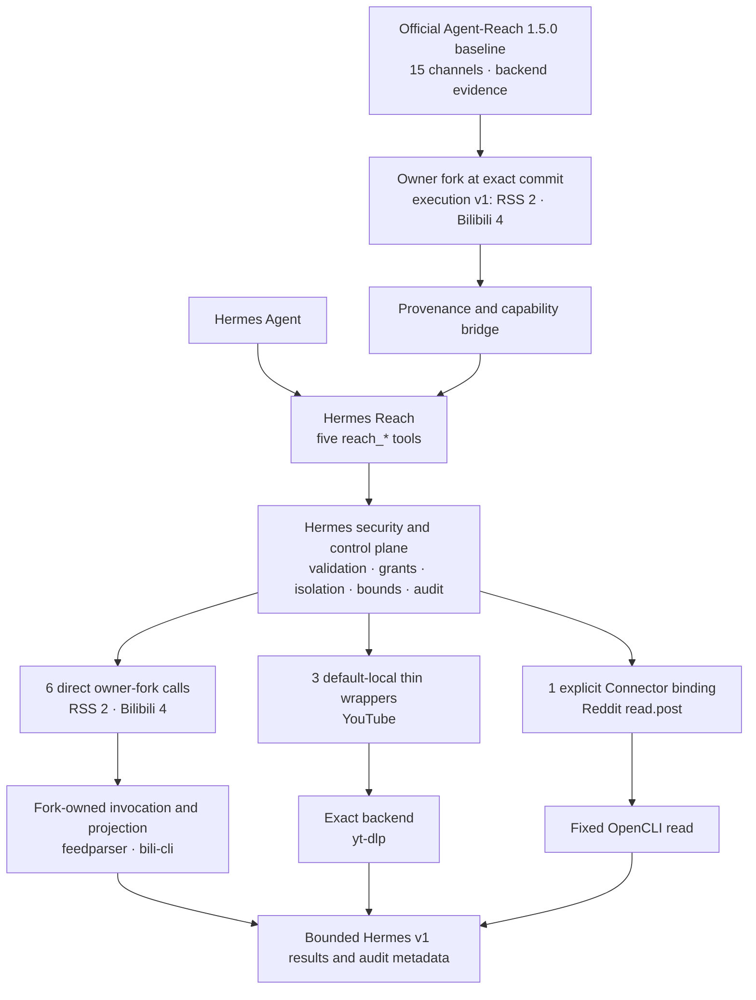
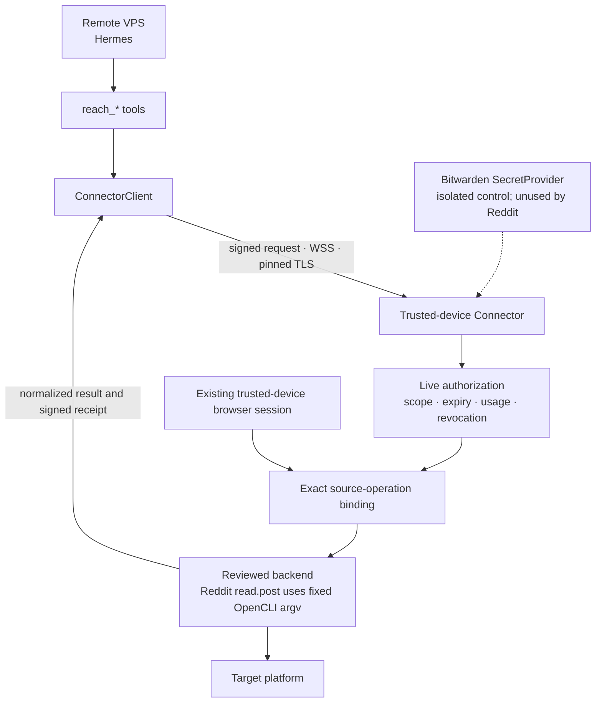

# Hermes Reach

[中文](README.md) | English

Hermes Reach gives Hermes a consistent set of read-only tools for public web and platform data while preserving a clear security boundary for remote VPS hosts.

It pins an [owner fork](https://github.com/izumi0uu/Agent-Reach) based on a
reviewed official [Agent-Reach](https://github.com/Panniantong/Agent-Reach)
baseline. The official baseline supplies channel, backend-routing, and
compatibility evidence; the fork's structured execution v1 currently carries
two RSS and four Bilibili operations. Hermes Reach then exposes search, read, browse, transcribe, and
status operations through a
[Hermes Agent](https://github.com/NousResearch/hermes-agent) plugin.

> [!IMPORTANT]
> The project is **pre-alpha**. The default local registry has six owner-fork
> RSS/Bilibili runtime calls and three fixed YouTube backend wrappers. The
> remote Connector can explicitly activate the single Reddit `read.post`
> OpenCLI wrapper at both ends, while default Connector composition remains
> empty; Web, GitHub, V2EX, and other unaudited platforms remain planned and
> unavailable. The fork does not make the other 57 catalog operations
> executable.

## The problem Hermes Reach solves

When Hermes runs on a virtual private server (VPS), it needs internet access without also receiving your platform passwords, cookies, and access keys.

Hermes Reach separates that problem into three parts:

- Hermes calls only five stable `reach_*` tools
- Every request names an explicit source and read-only operation
- Account-backed operations are intended to run on your trusted device instead of copying credentials to the VPS

For example, Hermes can summarize an RSS feed, search Bilibili videos, or read YouTube subtitles. Those tasks do not grant permission to publish content, modify an account, or call arbitrary platform backends.

## When Hermes runs on a VPS

Hermes Reach assumes that an attacker may fully compromise the VPS. Its security model limits what the attacker can obtain instead of treating the server as permanently trusted.

### Protections enforced today

- Tools support retrieval only, with no publishing, comments, likes, or other external mutations
- Requests must name a source and never fan out to every platform automatically
- The runtime limits time, response size, result count, and pagination
- Public HTTP retrieval used by RSS blocks local/private addresses, DNS rebinding, proxies, and HTTPS downgrades
- Unreviewed backends remain disabled instead of falling back to a broader execution path

### Explicit Connector activation (pre-alpha)

The Connector runs on your computer or another trusted device. Passwords, cookies, browser sessions, and Bitwarden tokens remain there. The VPS receives only expiring, usage-limited, revocable grants.

The codebase contains identity, live authorization, pinned TLS, original-terminal unlock, VPS pairing, local availability snapshots, isolated Bitwarden resolution, and protected-request/result envelopes. `reddit:read.post` is the first exact binding that can be activated explicitly: it extracts a post ID from a canonical Reddit URL and invokes one fixed OpenCLI read command. The trusted device must attest the executable through `--reddit-opencli`, and the VPS must explicitly point to paired local state containing the exact `reddit:read.post:public` grant. Either missing gate fails closed, and a default installation never discovers or runs OpenCLI.

Before deployment, read the [Connector security and operations guide](docs/connector-security.md) for the network, grant, key-recovery, audit, and rollback boundaries. This activation path remains pre-alpha and does not authorize a generic command, credential, or platform capability.

<details>
<summary>View the implemented Connector security foundations</summary>

| Mechanism | Purpose |
| --- | --- |
| Device identity and pairing | Pin trusted-device and VPS identities and reject silent key replacement |
| Original terminal (TTY) unlock | Accept the passphrase only from the terminal captured when the foreground service starts |
| SQLite live authority | Atomically check scope, expiry, revocation, replay, and remaining uses |
| Secure WebSocket (WSS) with pinned TLS | Pin the certificate authority and validate the current short-lived certificate |
| Signed receipts | Correlate requests, grant revisions, backends, and usage accounting |
| Isolated Bitwarden resolution | Resolve one opaque capability binding in a constrained child process without exposing vault configuration to the VPS |
| Request/result envelopes | Transport protected requests and bind bounded normalized results into signed receipts |
| VPS pairing and status snapshots | Persist pinned identity, the first grant, and short-lived no-network health state |
| Foreground ConnectorService | Activate authorization after trusted-device unlock and deliver an authorized exact operation to an explicitly injected executor |

</details>

### Risks that remain

The VPS sees each approved query and result. If an attacker compromises it while a grant remains active, the attacker may consume the remaining uses. Transport Layer Security (TLS) cannot protect an endpoint that is already compromised.

## What you can use today

The default installation registers five tools, but `reach_status` remains authoritative for source and operation availability.

| State | Sources | Available operations |
| --- | --- | --- |
| Locally available | RSS/Atom | Read feeds and browse entries through owner-fork execution v1 with fixed `feedparser` provenance |
| Locally available | Bilibili | Search/read videos and browse hot/rank through owner-fork execution v1 with fixed `bili-cli` provenance |
| Locally available | YouTube | Search/read videos and read subtitles through three fixed `yt-dlp` paths |
| Explicitly configurable | Reddit | `read.post` only; requires activation on both the trusted device and VPS and remains unavailable by default |
| Implemented, unbound | YouTube | `read.comments` remains `setup_required` and performs no backend call |
| Planned, unbound | Exa | `reach_status` reports `setup_required` with no binding; the closed contracts await a pinned `mcporter` closure and retention review |
| Planned, unavailable | Web, GitHub, V2EX, Twitter/X, Xiaohongshu, Facebook, Instagram, LinkedIn, Xueqiu, Xiaoyuzhou, and all other Reddit operations | Await an official callable or a safe exact Agent-Reach-selected backend |

The five tools have narrow responsibilities:

- `reach_status`: check whether a source and operation are available
- `reach_search`: search 1 to 5 explicit sources
- `reach_read`: read one exact target
- `reach_browse`: browse a source-native collection
- `reach_transcribe`: transcribe supported media; unavailable by default today

Credential-free access is not unlimited. Public sources remain subject to platform rate limits, content visibility, and terms of service.

## Get started

The project does not have a stable release. The approved first public channel
is GitHub Pre-releases and requires Python 3.11 through 3.13, `uv`, GitHub CLI,
and Hermes Agent 0.19.x.

### Install from a GitHub pre-release

The workflow uploads exactly three assets: the wheel, sdist, and `SHA256SUMS`.
GitHub separately renders generated `Source code (zip)` and
`Source code (tar.gz)` tag snapshots. They are not workflow-uploaded assets and
are not covered by `SHA256SUMS` or this workflow's attestations. After
`v0.1.0a1` appears in GitHub Releases, download the three workflow assets from
any empty directory:

```bash
RELEASE_TAG=v0.1.0a1
RELEASE_DIR="hermes-reach-${RELEASE_TAG}"
gh release download "$RELEASE_TAG" \
  --repo izumi0uu/hermes-reach \
  --dir "$RELEASE_DIR"

gh attestation verify \
  "$RELEASE_DIR/hermes_reach-0.1.0a1-py3-none-any.whl" \
  --repo izumi0uu/hermes-reach \
  --signer-workflow izumi0uu/hermes-reach/.github/workflows/release.yml
gh attestation verify \
  "$RELEASE_DIR/hermes_reach-0.1.0a1.tar.gz" \
  --repo izumi0uu/hermes-reach \
  --signer-workflow izumi0uu/hermes-reach/.github/workflows/release.yml
```

The two commands verify the wheel and sdist separately and restrict the signer
to this repository's reviewed release workflow. `SHA256SUMS` itself is not an
attestation subject; it only records the expected digests for the two
distributions. Then verify those digests. On macOS:

```bash
cd "$RELEASE_DIR"
shasum -a 256 --check SHA256SUMS
cd ..
```

On GNU/Linux, replace the second line with
`sha256sum --check SHA256SUMS`. On Windows, compare
`Get-FileHash -Algorithm SHA256` results with the manifest. The attestation
checks authenticate each distribution's workflow provenance; SHA-256 only
detects changed bytes and does not authenticate the publisher by itself.

Install the wheel into the same Python environment that actually runs Hermes.
The paths below are placeholders; do not substitute whichever Python happens
to be active in the current shell:

```bash
HERMES_PYTHON=/absolute/path/to/hermes-environment/bin/python
HERMES_BIN=/absolute/path/to/hermes-environment/bin/hermes

uv pip install \
  --python "$HERMES_PYTHON" \
  "$RELEASE_DIR/hermes_reach-0.1.0a1-py3-none-any.whl"
uv pip check --python "$HERMES_PYTHON"

"$HERMES_BIN" plugins enable reach --no-allow-tool-override
```

Windows environments normally use `Scripts\python.exe` and
`Scripts\hermes.exe` from the same environment. Installing the wheel does not
enable it, and the explicit command above does not grant tool override
authority. Start a new Hermes session after enabling, then inspect local
capabilities:

```bash
"$HERMES_BIN" reach status --json
"$HERMES_BIN" reach sources --json
"$HERMES_BIN" reach doctor --json
```

This pre-release wheel is not an offline dependency bundle. Installation needs
Git, PyPI network access, and GitHub HTTPS access for the exact
`izumi0uu/Agent-Reach` owner-fork integration commit. It resolves all other
declared dependencies without reading this repository's `uv.lock`. Before
release, that commit must have an immutable integration tag protected from
movement and deletion so old installs and rollback remain reachable. The tag
is only a recovery reference, not a dependency selector; the exact commit
remains authoritative.

To roll back a wheel installation, disable it first, start a new session
without Reach, then uninstall it through the package manager for that same
Python environment:

```bash
"$HERMES_BIN" plugins disable reach
uv pip uninstall --python "$HERMES_PYTHON" hermes-reach
uv pip check --python "$HERMES_PYTHON"
```

### Develop from a source checkout

Install dependencies and enable the plugin from the repository root:

```bash
uv sync --all-groups
uv run hermes plugins enable reach --no-allow-tool-override
```

Hermes disables third-party plugins by default. Start a new Hermes session after enabling the plugin, then inspect local capabilities:

```bash
uv run hermes reach status --json
uv run hermes reach sources --json
uv run hermes reach doctor --json
```

Source-environment rollback also starts by disabling the plugin and starting a
new session:

```bash
uv run hermes plugins disable reach
```

Then uninstall it from the default project environment, `.venv`:

```bash
uv pip uninstall --python .venv/bin/python hermes-reach
```

On Windows, replace the interpreter path with `.venv\Scripts\python.exe`.

Hermes' own `plugins remove`, `plugins rm`, and
`plugins uninstall` commands remove directory plugins under
`HERMES_HOME/plugins`; they do not uninstall pip wheels. Disabling before
uninstalling also prevents a stale enabled entry from activating a future
installation with the same plugin key. Running `uv sync` again in the source
checkout reinstalls the current project; leave it disabled when the goal is to
keep the installed plugin inactive.

Load the `reach:agent-reach` skill and enable the `reach` toolset when starting a session. Then describe the retrieval task:

```text
Check whether YouTube subtitle reading is available.
Then read Chinese subtitles from the specified video.
```

The default doctor checks local state only. `hermes reach doctor --upstream` also runs the restricted and redacted Agent-Reach checks.

### Enable Reddit `read.post`

Initialize state on the trusted device, then start the only permitted OpenCLI executor in the foreground:

```bash
uv run hermes reach connector init \
  --role connector \
  --state-directory /absolute/connector-state

uv run hermes reach connector serve \
  --state-directory /absolute/connector-state \
  --bind 100.64.0.10 \
  --port 8765 \
  --reddit-opencli /absolute/path/to/opencli
```

`serve` displays the canonical path, SHA-256, and exact scope on the original terminal and accepts only the literal confirmation `enable`. After confirmation, enter `unlock` at the `Connector>` prompt on that same original terminal and supply the Connector passphrase; the listener starts only after this unlock succeeds. Keep the foreground process running, then initialize and pair the VPS:

```bash
uv run hermes reach connector init \
  --role vps \
  --state-directory /absolute/vps-state

uv run hermes reach connector pair \
  --state-directory /absolute/vps-state \
  --connector wss://100.64.0.10:8765 \
  --device-label hermes-vps \
  --scope reddit:read.post:public
```

While `pair` waits, enter `pending` at the trusted device's `Connector>` prompt. After comparing both displays, enter `approve <pairing-id>` and type the literal `approve` at its confirmation prompt. Once pairing completes, `lock` stops the trusted listener; leave it unlocked to execute requests.

Finally, start the Hermes process on the VPS with the same absolute state directory:

```bash
HERMES_REACH_VPS_STATE_DIRECTORY=/absolute/vps-state hermes ...
```

This environment value is only a pointer to owner-only local paired state. It is not a secret and cannot widen the grant. Pairing or local state changes require a Hermes restart; server-side revocation takes effect on the next request. A valid grant normally reports `degraded` until the first signed success changes it to `available`. If the VPS recently received signed `backend_unbound`, the local failure snapshot can take up to about 60 seconds after the trusted binding is repaired to return to retryable `degraded`. See the [Connector security and operations guide](docs/connector-security.md) for the full procedure.

## How the system works

Hermes Reach integrates the exact pinned Agent-Reach owner fork through
`hermes_reach.register`. The official baseline supplies the 15-channel
registry, backend-routing evidence, compatibility metadata, and restricted
doctor. Fork execution v1 currently owns two RSS and four Bilibili operations. Hermes Reach
supplies the five closed tools, security policy, host capability, Connector,
normalization, and audit. Other platform retrieval remains with the exact
backend selected by Agent-Reach.



### How much of Agent-Reach is reused

The 15-channel registry, backend metadata, and official compatibility baseline
come from official Agent-Reach. Owner-fork execution v1 directly runs two RSS and four Bilibili
operations. The Hermes product catalog has 63 read-only operations: 11 are
marked implemented and 52 are planned. Ten have concrete executors: six
owner-fork runtime calls and four exact-backend wrappers (three YouTube and one
Connector-only Reddit). Nine bindings are default-local and
one is Connector-only. One additional contract, `youtube:read.comments`, is
implemented but unbound and is not counted as a concrete executor.

Official Agent-Reach 1.5.0 has no unified structured operation execution API,
so the number of direct official runtime calls remains zero. The reviewed owner
fork adds only operation-scoped execution and currently owns exactly six
RSS/Bilibili calls; it is not a general 15-channel runtime. Other executable paths use
fixed wrappers around exact Agent-Reach-selected backends. The 13 former Hermes
platform implementations for Web, GitHub, and V2EX are disabled; Hermes-native
and reimplementation exceptions are both zero.

Hermes Reach owns protocol, authorization, host capabilities, safe invocation,
normalization, bounds, redaction, receipts, and audit. RSS/Bilibili invocation
and source-native projection belong to the exact owner fork; other platform knowledge, backend
selection, and retrieval semantics stay in official Agent-Reach evidence or
its exact backend. See
[Agent-Reach as a Hermes plugin](docs/agent-reach-plugin-boundary.md) for the
canonical architecture and the
[Agent-Reach reuse boundary](docs/agent-reach-reuse-boundary.md) for the
operation matrix and reactivation gates.

The project pins Agent-Reach `1.5.0`: the reviewed official base is
`b4d52c46c9113cb0f653d6df4cf71ebadf4930ac`, the owner-fork integration commit
is `f195253d53befdb012d7aa575e732ec627ec29ac`, and the execution protocol is
`v1`. The complete 63-row state lives in the
[operation ledger](docs/agent-reach-operation-ledger.json); the two RSS and four
Bilibili descriptors do not claim execution support for the other 57 rows. The
current commit's immutable recovery tag is
`hermes-reach-integration-0.1.0a2`; rollback uses exact commit
`806205fd106f4f4453624becfd773acce8418cf1` and recovery tag
`hermes-reach-integration-0.1.0a1`. Tags preserve reachability only; the exact
commit remains dependency authority.

### Connector path when explicitly composed

An exact binding can execute a reviewed source backend on the trusted device. The current Reddit slice follows Agent-Reach routing evidence but permits only a fixed OpenCLI post-read argv; the VPS cannot select commands, credentials, providers, browser sessions, or local paths. The default composition supplies no binding; it is added only when `--reddit-opencli` and paired VPS state are both present. Every additional source must still pass its own security design and tests.



## Roadmap

The roadmap describes development order, not release dates. Incomplete capabilities remain disabled.

| Stage | Goal | Main work |
| --- | --- | --- |
| Complete | Stabilize public retrieval | Five tools, the 63-operation Hermes product catalog, read-only policy, and official Agent-Reach registry bridge |
| Complete | Secure pairing and client foundation | ConnectorClient, pinned identity and grants, local availability snapshots, signed requests and receipts |
| Complete | Isolate credentials and freeze the execution protocol | Bitwarden SecretProvider, protected-request and normalized-result envelopes |
| Complete | Exact remote execution bridge | Explicit Connector adapters, authorized-operation delivery, receipts, and retries; default composition remains empty |
| Complete | First source executor | Fixed OpenCLI read, closed YAML mapping, and WSS receipt test for Reddit `read.post`; unbound by default |
| Complete | Explicit two-sided production composition | Attest and confirm OpenCLI on the trusted device; build the sole Reddit adapter from owner-only paired VPS state |
| Complete | RSS/Bilibili fork execution and exact local backends | Two RSS and four Bilibili direct owner-fork runtime calls; three YouTube default-local wrappers; YouTube comments remains unbound |
| Complete | Freeze strict plugin boundary | Disable 13 Web/GitHub/V2EX platform exceptions while retaining catalog discovery and historical evidence |
| Complete | Verify the real plugin lifecycle | Prove default-disabled install, enable, disable, and package-manager uninstall in a clean Hermes 0.19 environment |
| Now | Establish a public pre-release channel | Install one exact sdist offline, lifecycle-test the exact wheel, then checksum and attest both before least-privilege publication |
| Then | Review structured execution evidence | Choose one narrow owner-fork contract or exact Agent-Reach backend per planned operation; build no Hermes platform runtime and expose no generic fork dispatch |
| Later | Support authenticated platforms and production operations | Twitter/X and similar sources, one-step grants, audit export, alerts, upgrades, and rollback |

## Development

The project uses `uv` for its environment and lockfile:

```bash
uv sync --all-groups
uv run ruff check .
uv run ruff format --check .
uv run mypy src
uv run pytest
uv lock --check
uv build
```

Maintainer release steps and repository-protection prerequisites are in the
[release guide](docs/releasing.md).

Hermes Reach is currently version `0.1.0a1` and uses the [MIT License](LICENSE).
