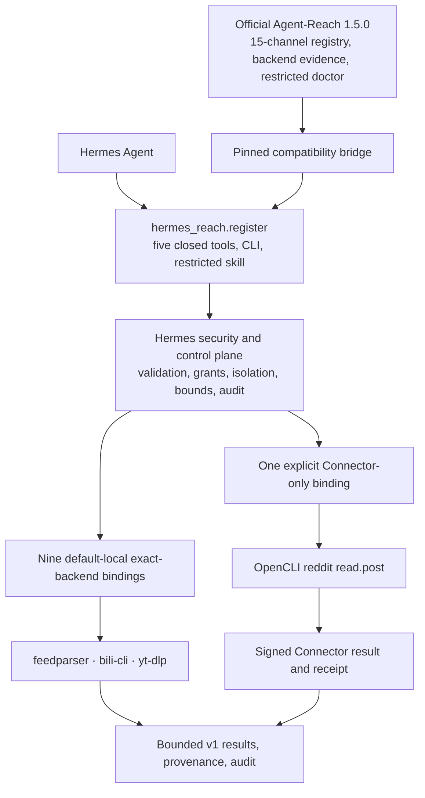

# Agent-Reach as a Hermes plugin

Status: canonical architecture, frozen on 2026-07-28 against official
Agent-Reach `1.5.0` at commit
`1494c2ab239e7355a77e7cceaf3271453a1f34b5`.

Hermes Reach is the Hermes plugin adapter around the official pinned
[Agent-Reach](https://github.com/Panniantong/Agent-Reach) project and the
backends selected by that project. It is not a fork of Agent-Reach and it does
not maintain a replacement Agent-Reach runtime.

## How the adapter is structured



Agent-Reach is embedded through a pinned Python dependency and a compatibility
bridge. Hermes does not require Agent-Reach to implement the Hermes plugin
contract:
`hermes_reach.register` is the entry point that exposes Agent-Reach routing
knowledge and selected backends through Hermes's closed security boundary.

Agent-Reach 1.5.0 does not ship a unified, structured operation execution
application programming interface (API).
Consequently, zero operations call an official Agent-Reach runtime directly.
That is an upstream fact, not unfinished Hermes work. When the official pinned
release already provides a safe callable, Hermes may use it. Otherwise, the
normal integration is a fixed thin wrapper around the exact backend selected
by Agent-Reach.

## Who owns each boundary

| Boundary | Owner | Responsibility |
| --- | --- | --- |
| Hermes plugin lifecycle | Hermes Reach | Plugin entry point, five `reach_*` tools, `reach` command-line interface (CLI), skill registration |
| Channel and backend authority | Official Agent-Reach | 15-channel registry, backend ordering evidence, compatibility metadata, reviewed doctor inputs |
| Platform retrieval semantics | Official callable or exact selected backend | Endpoints, extraction, native ordering, metadata discovery, platform network behavior |
| Security and control plane | Hermes Reach | Closed validation, grants, Connector, Bitwarden isolation, process and network containment, cancellation, redaction, receipts, audit, rollback |
| Product contract | Hermes Reach | The 63-operation v1 catalog, availability, normalized groups/items/errors, result bounds |
| Routing skill | Hermes Reach safety overlay | Routes only through the five closed tools; never grants raw shell, browser, Model Context Protocol (MCP), setup, or mutation authority |

The 63-operation catalog is a Hermes product contract derived from reviewed
Agent-Reach evidence. Agent-Reach 1.5.0 owns a 15-channel registry, not a
structured 63-operation catalog.

The packaged `reach:agent-reach` skill is deliberately not the upstream skill
verbatim. The upstream material remains pinned routing evidence, but includes
free-form setup, shell, browser-session, MCP, and mutation-capable surfaces
that do not satisfy the compromised virtual private server (VPS) threat model.

## Current executable surface

| Surface | Operations | Binding |
| --- | ---: | --- |
| Really Simple Syndication (RSS)/Atom | 2 | Default-local wrappers around `feedparser==6.0.12` |
| Bilibili | 4 | Default-local wrappers around `bilibili-cli==0.6.2` |
| YouTube | 3 | Default-local wrappers around `yt-dlp==2026.7.4` with pinned `yt-dlp-ejs` and Deno closure |
| Reddit | 1 | Connector-only fixed OpenCLI `read.post`; absent from default composition |
| YouTube comments | 1 | Catalog-implemented but unbound and `setup_required` |

The frozen accounting is:

```text
Hermes catalog operations                 63
implemented                               11
planned                                   52
concrete exact-backend executors          10
default-local bindings                     9
Connector-only bindings                    1
implemented but unbound                    1
Hermes-owned platform exceptions           0
direct official Agent-Reach runtime calls  0
```

The concrete executor count excludes `youtube:read.comments` because no
backend call is registered. The local-binding count excludes
`reddit:read.post` because Connector activation is explicit at both ends.

Web `read.url`, all eight GitHub operations, and all four V2EX operations stay
discoverable in the stable catalog but are planned and unavailable. Their
former Hermes-owned endpoint/parser implementations were removed under the
strict adapter-purity decision. Historical evidence and reactivation gates are
kept in `docs/agent-reach-decisions/`; they are not production authority.
The shared adapter registry rejects bindings for every catalog row that is
still `planned`, so another composition path cannot silently restore any of
these operations.

## Thin-wrapper rule

An exact-backend wrapper may:

- validate a closed source-operation request;
- attest a pinned executable or package;
- isolate the process, environment, network access, and credentials;
- impose timeout, cancellation, input, output, item, and character bounds;
- normalize a closed v1 result and record redacted provenance; and
- produce signed Connector results, receipts, and audit evidence.

It may not invent or select a platform endpoint, document object model (DOM)
selector, response parser,
pagination rule, credential import, backend fallback, browser action, MCP
method, executable, command, or argv. Public requests never choose those
details.

Hermes's internal `hermes_reach.runtime` package remains valid. It is the
policy, dispatch, bounds, retry, and audit control plane; it must not be
described as an Agent-Reach runtime.

## Reactivation and roadmap

A planned operation can become executable only after review identifies either:

1. a callable already shipped by an official pinned Agent-Reach commit that
   satisfies the security boundary; or
2. the exact Agent-Reach-selected backend with a fixed, attestable, bounded
   invocation and no Hermes-owned platform semantics.

An absent upstream execution API is not permission to create one locally or in
a maintained fork. Contributions to Agent-Reach are welcome, but Hermes adopts
them only after they land in an official reviewed commit. Any Agent-Reach pin
change reopens the complete 63-operation audit.

Operation-level evidence lives in
[Agent-Reach reuse boundary](agent-reach-reuse-boundary.md). Connector threats,
activation, recovery, and rollback live in
[Connector security and operations](connector-security.md).
