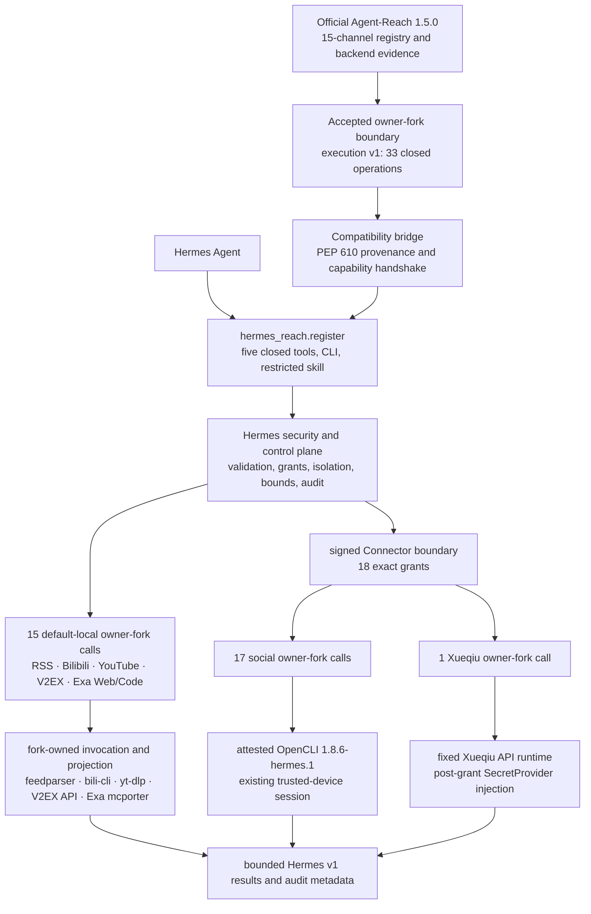

# Agent-Reach as a Hermes plugin

Status: canonical architecture. The runtime was reviewed on 2026-08-02 against
official Agent-Reach `1.5.0` base
`b4d52c46c9113cb0f653d6df4cf71ebadf4930ac`. Owner-fork PR #6's final reviewed
head `e91e3efa045e75f08d4e7fdd9749fe26d4f774c5`, tree
`e86ee839621360b991d985ad9d4cb18e36f86351`, was rebase-merged with tree
equivalence into `hermes/execution-v1` as final integration commit
`75cd48c6274e7f4740530d97877ec048708d5334`. It contains exactly 33 descriptors
and is the exact dependency pin. The integration branch remains untagged and
is not publishable until immutable recovery-tag protection and final Hermes
verification are complete. The rejected pre-freeze candidate, commit
`7bc42839d3dd290e4af93b24e0b03b738cff0ffa` (tree
`382557e0bec76819f0633f31895580a0f549b6bd`) is retained only as rejection
evidence because it contains two unsafe LinkedIn descriptors.

Hermes Reach is a Hermes security wrapper around an exact, owner-maintained
[Agent-Reach fork](https://github.com/izumi0uu/Agent-Reach). That fork is based
on the reviewed [official Agent-Reach](https://github.com/Panniantong/Agent-Reach)
commit above. Hermes Reach does not copy the Agent-Reach runtime or platform
implementations into this repository.

The fork adds one small, versioned execution boundary that official
Agent-Reach 1.5.0 does not provide. The accepted boundary owns exactly 33
operations: two RSS, four Bilibili, three YouTube, four V2EX, Exa `search.web`, and all 15
catalog operations for Reddit, Facebook, and Instagram, plus Twitter and
Xiaohongshu search, Xueqiu stock search, and Exa
`search.code`. Every other
operation remains implemented but unbound or not
implemented according to the closed operation ledger. The presence of the fork
is not evidence that all 15 channels or all 63 Hermes operations are
executable; 30 catalog rows remain outside fork execution.

## How the adapter is structured



`hermes_reach.register` remains the only Hermes plugin entry point. It exposes
five closed tools, the `reach` operator command, and the reviewed
`reach:agent-reach` skill. It never exposes the fork API, a backend selector,
raw command, argv, browser session, credential, or arbitrary Agent-Reach
operation to Hermes tool input.

The compatibility bridge validates the installed distribution before plugin
registration:

- Agent-Reach version is exactly `1.5.0`;
- PEP 610 provenance names the owner fork and exact reviewed batch commit;
- before any fork code is imported, RECORD metadata and the current on-disk
  digest match for all 14 installed files, including both parent package
  initializers, the execution modules, and the OpenCLI lifecycle guard;
- the fork reports execution protocol `v1`;
- static discovery contains exactly 33 ordered descriptors, including the four
  search additions, with closed schemas, host capabilities, backend
  identities/versions, and hard limits; and
- the 15-channel projection still matches the Hermes source catalog.

Any mismatch fails closed before a Reach tool, CLI command, or skill is
registered.

## Who owns each boundary

| Boundary | Owner | Responsibility |
| --- | --- | --- |
| Official baseline | Official Agent-Reach | 15-channel registry, backend ordering evidence, compatibility metadata, reviewed doctor inputs |
| Thirty-three execution operations | Owner Agent-Reach fork | Closed `execution.v1` discovery; fixed feedparser/bili-cli/yt-dlp/V2EX API/Exa mcporter/OpenCLI/Xueqiu API invocation; operation selection; source-native projection; error/partial classification; backend provenance |
| Hermes plugin lifecycle | Hermes Reach | Plugin entry point, five `reach_*` tools, `reach` CLI, skill registration |
| Security and control plane | Hermes Reach | Closed validation, grants, Connector, Bitwarden isolation, typed host capabilities, worker containment, timeout/cancellation, retry, normalization, redaction, receipts, audit, rollback |
| Account-session execution | Hermes Connector plus owner fork | Exact grants and trusted-device isolation around 17 OpenCLI and one Xueqiu operation; no Hermes platform parser, argv, endpoint, or MCP selector |
| Product contract | Hermes Reach | The 63-operation v1 catalog, availability, normalized groups/items/errors, result bounds |
| Routing skill | Hermes Reach safety overlay | Routes only through the five closed tools and never grants raw shell, browser, MCP, setup, or mutation authority |

The dependency direction is one way. The fork imports no Hermes types and
knows nothing about Hermes tools, grants, Connector, Bitwarden, receipts,
durable audit, or public response envelopes. Hermes provides the already
fetched bounded RSS document as one typed host capability. Bilibili, YouTube,
V2EX, and Exa receive a fieldless `NetworkAccessV1` marker only inside their
fixed isolated workers. YouTube subtitles additionally receive a fieldless
`PrivateWorkspaceV1` marker for the worker's per-attempt private current
directory. Exa Web/Code additionally receive `McporterArtifactsV1`, which contains
only operator-attested absolute artifact paths and identities. These
capabilities carry no request-selected endpoint, proxy, header, Cookie,
credential, command, backend, MCP method, or fallback, and grant no generic
fork dispatch. The social worker receives one `OpenCliSessionV1` containing
only the trusted device's attested Node/OpenCLI identities and session-home
path; this capability never crosses the signed VPS protocol or enters audit.
Xueqiu receives `XueqiuSessionV1`
only after an exact grant and SecretProvider lookup; its Cookie is absent from
VPS frames, public results, receipts, audit, argv, paths, and persisted state.

The worker is an isolated Python process with a minimal explicit environment,
a fixed root working directory, closed stdin/stdout framing, and no ambient
secrets. The Xueqiu Connector worker receives the only secret-bearing input: an
attempt-local `XueqiuSessionV1` Cookie capability assembled after exact grant
authorization and SecretProvider lookup. That capability never reaches a
default-local worker or the signed VPS protocol. Process isolation is not a
kernel-level syscall sandbox. A malicious accepted dependency could still
attempt ambient filesystem or network syscalls, so exact PEP 610 provenance,
commit review, artifact controls, and prompt rollback remain a supply-chain
trust boundary rather than being replaced by process isolation.

Hermes's internal `hermes_reach.runtime` remains the policy, dispatch, retry,
bounds, and audit control plane. It is not an Agent-Reach runtime and does not
own platform extraction semantics.

## Current executable surface

| Surface | Operations | Classification and binding |
| --- | ---: | --- |
| RSS/Atom | 2 | Direct owner-fork execution v1 calls in the default-local registry |
| Bilibili | 4 | Direct owner-fork execution v1 calls to fixed `bilibili-cli==0.6.2` operations in the default-local registry |
| YouTube | 3 | All three executable operations are direct owner-fork execution v1 calls to fixed `yt-dlp==2026.7.4`, with pinned EJS and Deno closure |
| V2EX | 4 | Direct owner-fork execution v1 calls to the fixed, bounded public API contract in the default-local registry |
| Exa Web | 1 | Direct owner-fork execution v1 contract on the default-local surface; remains `setup_required` until the complete Node/mcporter/config artifact attestation is supplied |
| Reddit | 7 | Direct owner-fork OpenCLI operations, Connector-only and absent from default composition |
| Facebook | 4 | Direct owner-fork OpenCLI operations, Connector-only and absent from default composition |
| Instagram | 4 | Direct owner-fork OpenCLI operations, Connector-only and absent from default composition |
| Twitter/X | 1 | Direct owner-fork OpenCLI search, Connector-only and absent from default composition |
| Xiaohongshu | 1 | Direct owner-fork OpenCLI search with session-bearing URL material removed, Connector-only |
| LinkedIn | 0 | People/jobs search remains planned, unbound, and unavailable after the MCP 4.14.0 stop condition |
| Xueqiu | 1 | Direct owner-fork stock search with post-authorization SecretProvider injection, Connector-only |
| Exa Code | 1 | Direct owner-fork default-local contract, sharing artifact attestation but not endpoint, method, or grammar with Exa Web |
| YouTube comments | 1 | Catalog-implemented but unbound and `setup_required` |

The frozen accounting is:

```text
Hermes catalog operations                  63
implemented                                34
planned                                    29
direct owner-fork runtime calls            33
exact-backend thin wrappers                 0
concrete executors                         33
default-local bindings                     15
Connector-only bindings                    18
implemented but unbound                     1
operations outside fork execution           30
Hermes-owned platform exceptions            0
direct official Agent-Reach runtime calls   0
```

All 33 concrete executors call the direct owner-fork runtime. Eighteen executors
are Connector-only; the other 15 are default-local.
The accounting treats Exa Web and Code as default-local binding surfaces because their
closed executor is implemented, but the default process does not compose it
until all seven artifact-attestation environment values are present and well
formed. Composition is I/O-free; the worker still verifies the actual
artifacts before provider execution.
It excludes `youtube:read.comments`, which has no binding or backend attempt.

Web `read.url`, all eight GitHub operations, and both LinkedIn searches stay
discoverable but planned and unavailable. Their former or rejected execution
paths remain closed. Exa Code is a distinct reviewed `query + numResults`
operation and cannot be substituted by Exa Web. The shared registry rejects
bindings for every catalog row that is still `planned`.

LinkedIn's rejection is frozen in the
[MCP 4.14.0 stop-condition decision](agent-reach-decisions/linkedin-scraper-mcp-4.14.0.md):
query-bearing warning logs, persisted query diagnostics, an unbound service
identity, and retry interaction with `section_errors` prevent activation.

The complete machine-readable state lives in
[agent-reach-operation-ledger.json](agent-reach-operation-ledger.json). The
smaller [review manifest](agent-reach-reuse-decisions.json) contains detailed
P0/P1/P2 evidence. It has exactly 44 rows: 33 `direct_owner_fork_runtime` and
11 `not_implemented` (`33 direct + 11 not implemented`); neither file grants
authority beyond its exact rows.

## Why this is not a copied runtime

The execution fork is deliberately additive and narrow:

- fork `main` remains a fast-forward mirror of official `main`;
- execution work is rebased on a recorded official base;
- capability discovery is static and I/O-free;
- requests select only a registered source, operation, and closed arguments;
- host capabilities, limits, cancellation, private state, and secrets are not
  caller-controlled;
- results use closed typed schemas and redacted error codes; and
- migrated invocation and source projection are removed from Hermes rather
  than maintained twice.

This architecture moves 33 operation-scoped platform semantics to Agent-Reach
while leaving the compromised-VPS controls in Hermes. Expanding the fork in a
homogeneous reviewed batch is allowed only when each operation retains its own
closed descriptor and the same ownership, safety, compatibility, and
63-operation audit gates pass. It is not permission to copy every channel or
expose a generic execution surface.

## Fork updates, recovery, and rollback

Hermes depends on an exact reviewed fork commit, never a branch or tag. The
final integration is `75cd48c6274e7f4740530d97877ec048708d5334`, with tree
`e86ee839621360b991d985ad9d4cb18e36f86351`. It is the exact Hermes dependency
pin and the tree-equivalent rebase integration of owner-fork PR #6's final
reviewed head `e91e3efa045e75f08d4e7fdd9749fe26d4f774c5` into
`hermes/execution-v1`. The integration branch remains untagged and is not
release-eligible. Before publication, its immutable recovery tag must be
protected from movement and deletion, and Hermes must complete the final
provenance, RECORD, runtime, and pin-sensitive verification gates.

The rejected pre-freeze commit
`7bc42839d3dd290e4af93b24e0b03b738cff0ffa`, with tree
`382557e0bec76819f0633f31895580a0f549b6bd`, is rejected because it contains 35
descriptors including LinkedIn. It is retained only as rejection evidence.
Rollback restores the prior 29-operation integration
`281dc3352c63cdb644f02e028cc5d645c279954a`, with tree
`385b9c95cb3a6372ed1b68b606abc3faed71f307`. It was rebase-merged from reviewed
hardlink-fix PR head `c57ae5b8d78fed6ad52a1f52731db589d875f8a9`, whose tree is identical.
The previous pre-hardlink-fix 29-operation integration
`ec4a5e36434c9df9ee236dc12734843163fc17ac` was rebase-merged from reviewed
head `a3dcdb3a6638e14ceda8cfa9a3cc7a010d80fa80`; both resolve to tree
`302db7526ed84b1565fa24baf5c06ced69385d80`. It is retained as provenance but
is incompatible with uv hardlink installs. The earlier 14-operation integration
`9b69146588b1d162515b81db26b51643c15de8eb` was rebase-merged from reviewed
head `fd93d2ec86511a4a1514b7ebd13cd996be709692`; both resolve to tree
`e19835071ae6560431b66d5a21e51b598d3d9c81`. It is the fail-closed social-batch
rollback pin and also has no recovery tag. The earlier final integration
`2a5829cf3b50bc435c647bfae4c050b1837d0235` was rebase-merged from audited
candidate `9e744d0c33f9e6498cf66c2ea376a653000e9be4`; both resolve to tree
`070e4507fde7e55eceaba4d29e6a459c4a972f60`, and protected immutable reference
`hermes-reach-integration-0.1.0a3` preserves final-integration reachability.
The older rollback commit `f195253d53befdb012d7aa575e732ec627ec29ac`
remains reachable through protected immutable reference
`hermes-reach-integration-0.1.0a2`. A tag is not a dependency selector; the
exact commit pin is authoritative.

For an upstream update:

1. fast-forward fork `main` to official `main`;
2. rebase the execution branch onto the new official head;
3. run fork tests, lint, type checks, build, and clean-wheel smoke;
4. rerun Hermes's complete 63-operation ledger and compatibility handshake;
5. after explicit owner approval, publish a new reviewed integration commit
   and immutable recovery reference;
6. update Hermes in a separate rebase-only change pinned to that commit.

Rollback of the accepted four-operation batch removes Twitter search,
Xiaohongshu search, Xueqiu stock search, and Exa Code, then restores the
previous Hermes release and exact dependency pin
`281dc3352c63cdb644f02e028cc5d645c279954a`. The older pin
`2a5829cf3b50bc435c647bfae4c050b1837d0235` remains reachable through
immutable reference `hermes-reach-integration-0.1.0a3`. The older pins
`f195253d53befdb012d7aa575e732ec627ec29ac` and
`806205fd106f4f4453624becfd773acce8418cf1` remain reachable through
`hermes-reach-integration-0.1.0a2` and
`hermes-reach-integration-0.1.0a1`, respectively. No public Hermes protocol,
Connector grant, database, receipt, or audit migration is required. A
consumed fork commit or immutable recovery reference must never be moved or
deleted.

Operation-level evidence lives in
[Agent-Reach reuse boundary](agent-reach-reuse-boundary.md). Connector threats,
activation, recovery, and rollback live in
[Connector security and operations](connector-security.md).
