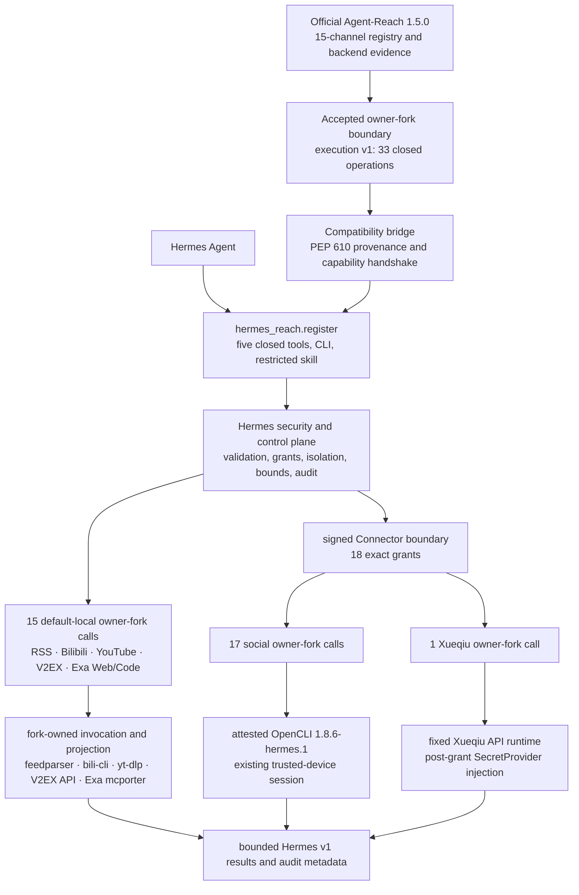

# Agent-Reach as a Hermes plugin

Status: canonical architecture, reviewed on 2026-08-02 against official
Agent-Reach `1.5.0` commit
`b4d52c46c9113cb0f653d6df4cf71ebadf4930ac`. The current execution boundary
contains exactly 33 descriptors.

Hermes Reach wraps the exact, owner-maintained
[Agent-Reach fork](https://github.com/izumi0uu/Agent-Reach) with Hermes security
controls. The fork is based on the reviewed
[official Agent-Reach](https://github.com/Panniantong/Agent-Reach) commit above.
This repository does not contain a copy of the Agent-Reach runtime or its
platform implementations.

Official Agent-Reach 1.5.0 has no versioned execution boundary. The fork adds
one for exactly 33 operations: two RSS, four Bilibili, three YouTube, four
V2EX, Exa `search.web`, all 15 catalog operations for Reddit, Facebook, and
Instagram, Twitter search, Xiaohongshu search, Xueqiu stock search, and Exa
`search.code`. The closed operation ledger marks every other operation as
implemented but unbound or not implemented. Of the 63 Hermes catalog rows, 30
remain outside fork execution.

## Runtime path



`hermes_reach.register` is the only Hermes plugin entry point. It registers
five closed tools, the `reach` operator command, and the reviewed
`reach:agent-reach` skill. Hermes tool input cannot access the fork API,
backend selectors, raw commands, argv, browser sessions, credentials, or
arbitrary Agent-Reach operations.

Before plugin registration, the compatibility bridge checks the installed
distribution:

- Agent-Reach is exactly version `1.5.0`.
- PEP 610 provenance names the owner fork and exact reviewed batch commit.
- RECORD metadata and the current on-disk digest must match for all 14
  installed files before any fork code is imported. These files include both
  parent package initializers, the execution modules, and the OpenCLI lifecycle
  guard.
- The fork reports execution protocol `v1`.
- Static discovery returns exactly 33 ordered descriptors, including the four
  search additions. Each descriptor has closed schemas, host capabilities,
  backend identity and version, and hard limits.
- The 15-channel projection matches the Hermes source catalog.

The bridge fails closed on any mismatch, before any Reach tool, CLI command, or
skill is available.

## Ownership

| Boundary | Owner | Responsibility |
| --- | --- | --- |
| Official baseline | Official Agent-Reach | Maintains the 15-channel registry, backend ordering evidence, compatibility metadata, and reviewed doctor inputs. |
| Thirty-three execution operations | Owner Agent-Reach fork | Provides closed `execution.v1` discovery and fixed calls to feedparser, bili-cli, yt-dlp, the V2EX API, Exa mcporter, OpenCLI, and the Xueqiu API. It selects operations, projects source-native results, classifies errors and partial results, and reports backend provenance. |
| Hermes plugin lifecycle | Hermes Reach | Registers the plugin entry point, five `reach_*` tools, the `reach` CLI, and the skill. |
| Security and control plane | Hermes Reach | Applies closed validation and grants. It owns Connector, Bitwarden isolation, typed host capabilities, worker containment, timeout and cancellation, retry, normalization, redaction, receipts, audit, and rollback. |
| Account-session execution | Hermes Connector plus owner fork | Applies exact grants and trusted-device isolation to 17 OpenCLI operations and one Xueqiu operation. Hermes supplies no platform parser, argv, endpoint, or MCP selector. |
| Product contract | Hermes Reach | Defines the 63-operation v1 catalog, availability, normalized groups, items and errors, and result bounds. |
| Routing skill | Hermes Reach safety overlay | Routes through the five closed tools. It grants no raw shell, browser, MCP, setup, or mutation access. |

Dependencies point from Hermes Reach to the fork. The fork imports no Hermes
types and has no knowledge of Hermes tools, grants, Connector, Bitwarden,
receipts, durable audit, or public response envelopes.

Hermes passes a fetched, bounded RSS document through a typed host capability.
Bilibili, YouTube, V2EX, and Exa receive a fieldless `NetworkAccessV1` marker
inside their fixed isolated workers. YouTube subtitle operations also receive
a fieldless `PrivateWorkspaceV1` marker for the worker's private current
directory, which is new for each attempt. Exa Web and Exa Code also receive
`McporterArtifactsV1`. It contains only operator-attested absolute artifact
paths and identities.

These capabilities contain no request-selected endpoint, proxy, header,
Cookie, credential, command, backend, MCP method, or fallback. They do not
allow generic fork dispatch. The social worker receives one
`OpenCliSessionV1` containing only the trusted device's attested Node and
OpenCLI identities and its session-home path. This capability never crosses
the signed VPS protocol and is not written to audit. Xueqiu receives
`XueqiuSessionV1` only after an exact grant and SecretProvider lookup. Its
Cookie is absent from VPS frames, public results, receipts, audit, argv, paths,
and persisted state.

Each worker is an isolated Python process. It has a minimal explicit
environment, a fixed root working directory, closed stdin/stdout framing, and
no ambient secrets. Only the Xueqiu Connector worker receives secret-bearing
input: an attempt-local `XueqiuSessionV1` Cookie capability assembled after
exact grant authorization and SecretProvider lookup. The capability never
reaches a default-local worker or the signed VPS protocol.

Process isolation is not a kernel-level syscall sandbox. A malicious accepted
dependency could still attempt ambient filesystem or network syscalls. The
supply-chain trust boundary depends on exact PEP 610 provenance,
commit review, artifact controls, and prompt rollback. Process isolation does
not replace these controls.

Hermes's internal `hermes_reach.runtime` owns policy, dispatch, retry, bounds,
and audit. It is not an Agent-Reach runtime. Agent-Reach owns platform
extraction semantics.

## Current executable surface

| Surface | Operations | Classification and binding |
| --- | ---: | --- |
| RSS/Atom | 2 | Direct owner-fork execution v1 calls in the default-local registry |
| Bilibili | 4 | Direct owner-fork execution v1 calls to fixed `bilibili-cli==0.6.2` operations in the default-local registry |
| YouTube | 3 | All three executable operations are direct owner-fork execution v1 calls to fixed `yt-dlp==2026.7.4`, with pinned EJS and Deno closure |
| V2EX | 4 | Direct owner-fork execution v1 calls to the fixed, bounded public API contract in the default-local registry |
| Exa Web | 1 | Direct owner-fork execution v1 contract on the default-local surface; remains `setup_required` until the complete Node/mcporter/config artifact attestation is supplied |
| Reddit | 7 | Direct owner-fork OpenCLI operations, Connector-only and absent from default composition |
| Facebook | 4 | Direct owner-fork OpenCLI operations, Connector-only and absent from default composition |
| Instagram | 4 | Direct owner-fork OpenCLI operations, Connector-only and absent from default composition |
| Twitter/X | 1 | Direct owner-fork OpenCLI search, Connector-only and absent from default composition |
| Xiaohongshu | 1 | Direct owner-fork OpenCLI search with session-bearing URL material removed, Connector-only |
| LinkedIn | 0 | People/jobs search remains planned, unbound, and unavailable after the MCP 4.14.0 stop condition |
| Xueqiu | 1 | Direct owner-fork stock search with post-authorization SecretProvider injection, Connector-only |
| Exa Code | 1 | Direct owner-fork default-local contract, sharing artifact attestation but not endpoint, method, or grammar with Exa Web |
| YouTube comments | 1 | Catalog-implemented but unbound and `setup_required` |

These counts are frozen:

```text
Hermes catalog operations                  63
implemented                                34
planned                                    29
direct owner-fork runtime calls            33
exact-backend thin wrappers                 0
concrete executors                         33
default-local bindings                     15
Connector-only bindings                    18
implemented but unbound                     1
operations outside fork execution           30
Hermes-owned platform exceptions            0
direct official Agent-Reach runtime calls   0
```

All 33 concrete executors call the owner-fork runtime directly. Eighteen are
Connector-only, and 15 are default-local. Exa Web and Exa Code count as
default-local binding surfaces because their closed executors are implemented.
The default process composes them only when all seven artifact-attestation
environment values are present and well formed. Composition performs no I/O.
The worker verifies the artifacts before it calls the provider.

`youtube:read.comments` is not included in these bindings because it has no
binding or backend attempt.

Web `read.url`, all eight GitHub operations, and both LinkedIn searches are
discoverable, planned, and unavailable. Their former or rejected execution
paths are closed. Exa Code is a separate reviewed `query + numResults`
operation; Exa Web cannot replace it. The shared registry rejects a binding
for any catalog row marked `planned`.

LinkedIn's rejection is frozen in the
[MCP 4.14.0 stop-condition decision](agent-reach-decisions/linkedin-scraper-mcp-4.14.0.md):
query-bearing warning logs, persisted query diagnostics, an unbound service
identity, and retry interaction with `section_errors` prevent activation.

The complete machine-readable state is in
[agent-reach-operation-ledger.json](agent-reach-operation-ledger.json). The
[review manifest](agent-reach-reuse-decisions.json) contains detailed P0, P1,
and P2 evidence. It has exactly 44 rows: 33 `direct_owner_fork_runtime` and 11
`not_implemented` (`33 direct + 11 not implemented`). Runtime registration is
limited to the rows listed in these files.

## Fork rules

The execution branch follows these rules:

- Fork `main` is a fast-forward mirror of official `main`.
- Execution work is rebased on a recorded official base.
- Capability discovery is static and performs no I/O.
- Requests select only a registered source, operation, and closed arguments.
- Callers do not control host capabilities, limits, cancellation, private
  state, or secrets.
- Results use closed typed schemas and redacted error codes.
- Once invocation and source projection move to the fork, Hermes no longer
  maintains copies of them.

Agent-Reach owns the platform semantics for the 33 bound operations. Hermes
owns the controls for a compromised VPS. Operations may be added only in a
homogeneous reviewed batch. Each operation must have its own closed descriptor
and pass the existing ownership, safety, compatibility, and 63-operation audit
gates. A batch authorizes only its reviewed operation descriptors. It cannot
migrate an entire channel set or add generic dispatch.

## Fork updates, recovery, and rollback

Hermes depends on an exact reviewed fork commit, never a branch or tag. A tag
is not a dependency selector; the exact commit pin is authoritative. Recovery
tags do not select package publication.

The current pin is `75cd48c6274e7f4740530d97877ec048708d5334`, with tree
`e86ee839621360b991d985ad9d4cb18e36f86351`. Owner-fork PR #6's final reviewed
head, `e91e3efa045e75f08d4e7fdd9749fe26d4f774c5`, has the same tree. The PR was
rebase-merged into `hermes/execution-v1` as the current pin.

Current recovery mapping: `hermes-reach-integration-0.1.0a4` ->
`75cd48c6274e7f4740530d97877ec048708d5334`.

The protected immutable lightweight tag points directly to the current pin.
Repository ruleset `Protect Hermes Reach integration tags` (`19975135`) covers
this tag namespace, blocks update and deletion, and has no bypass actor. Hermes
has passed its final provenance, RECORD, runtime, pin-sensitive, and
exact-artifact checks. Publishing a Hermes Reach package is a separate
versioned release operation.

The rejected pre-freeze commit
`7bc42839d3dd290e4af93b24e0b03b738cff0ffa`, with tree
`382557e0bec76819f0633f31895580a0f549b6bd`, has 35 descriptors, including the
two unsafe LinkedIn descriptors. It remains only as rejection evidence.

### Integration history

The previous 29-operation integration is
`281dc3352c63cdb644f02e028cc5d645c279954a`, with tree
`385b9c95cb3a6372ed1b68b606abc3faed71f307`. It was rebase-merged from reviewed
hardlink-fix PR head `c57ae5b8d78fed6ad52a1f52731db589d875f8a9`, which has the same tree.

The earlier 29-operation integration
`ec4a5e36434c9df9ee236dc12734843163fc17ac` was rebase-merged from reviewed
head `a3dcdb3a6638e14ceda8cfa9a3cc7a010d80fa80`. Both have tree
`302db7526ed84b1565fa24baf5c06ced69385d80`. This integration remains as
provenance but does not work with uv hardlink installs.

The 14-operation integration
`9b69146588b1d162515b81db26b51643c15de8eb` was rebase-merged from reviewed
head `fd93d2ec86511a4a1514b7ebd13cd996be709692`. Both have tree
`e19835071ae6560431b66d5a21e51b598d3d9c81`. This is the fail-closed
social-batch rollback pin and has no recovery tag.

Integration `2a5829cf3b50bc435c647bfae4c050b1837d0235` was rebase-merged from
audited candidate `9e744d0c33f9e6498cf66c2ea376a653000e9be4`. Both have tree
`070e4507fde7e55eceaba4d29e6a459c4a972f60`. Protected immutable reference
`hermes-reach-integration-0.1.0a3` preserves final-integration reachability.

Older rollback commit `f195253d53befdb012d7aa575e732ec627ec29ac` is available
through protected immutable reference `hermes-reach-integration-0.1.0a2`.
Commit `806205fd106f4f4453624becfd773acce8418cf1` is available through
`hermes-reach-integration-0.1.0a1`.

### Updating the fork

1. Fast-forward fork `main` to official `main`.
2. Rebase the execution branch onto the new official head.
3. Run the fork tests, lint, type checks, build, and clean-wheel smoke test.
4. Run Hermes's complete 63-operation ledger and compatibility handshake.
5. After explicit owner approval, publish a new reviewed integration commit
   and immutable recovery reference.
6. Update Hermes in a separate rebase-only change pinned to that commit.

### Rollback

To roll back the accepted four-operation batch, remove Twitter search,
Xiaohongshu search, Xueqiu stock search, and Exa Code. Then restore the previous
Hermes release and exact dependency pin
`281dc3352c63cdb644f02e028cc5d645c279954a`. No public Hermes protocol,
Connector grant, database, receipt, or audit migration is required.

The current 33-operation integration remains available through
`hermes-reach-integration-0.1.0a4`. A consumed fork commit or immutable
recovery reference must never be moved or deleted.

Operation-level evidence lives in
[Agent-Reach reuse boundary](agent-reach-reuse-boundary.md). Connector threats,
activation, recovery, and rollback live in
[Connector security and operations](connector-security.md).
