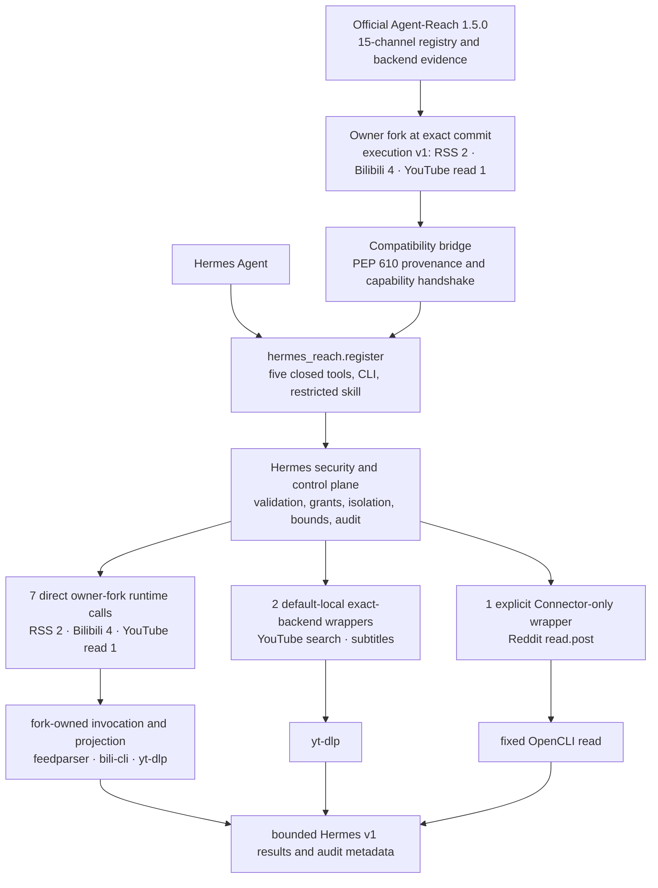

# Agent-Reach as a Hermes plugin

Status: canonical architecture, frozen on 2026-07-31 against official
Agent-Reach `1.5.0` base
`b4d52c46c9113cb0f653d6df4cf71ebadf4930ac` and reviewed owner-fork integration
commit `2a5829cf3b50bc435c647bfae4c050b1837d0235`.

Hermes Reach is a Hermes security wrapper around an exact, owner-maintained
[Agent-Reach fork](https://github.com/izumi0uu/Agent-Reach). That fork is based
on the reviewed [official Agent-Reach](https://github.com/Panniantong/Agent-Reach)
commit above. Hermes Reach does not copy the Agent-Reach runtime or platform
implementations into this repository.

The fork adds one small, versioned execution boundary that official
Agent-Reach 1.5.0 does not provide. Today it owns exactly seven operations: two
RSS operations, four Bilibili operations, and YouTube `read.video`. Every other operation remains an
exact-backend wrapper, implemented but unbound, or not implemented according
to the closed operation ledger. The presence of the fork is not evidence that
all 15 channels or all 63 Hermes operations are executable; 56 catalog rows
remain outside fork execution.

## How the adapter is structured



`hermes_reach.register` remains the only Hermes plugin entry point. It exposes
five closed tools, the `reach` operator command, and the reviewed
`reach:agent-reach` skill. It never exposes the fork API, a backend selector,
raw command, argv, browser session, credential, or arbitrary Agent-Reach
operation to Hermes tool input.

The compatibility bridge validates the installed distribution before plugin
registration:

- Agent-Reach version is exactly `1.5.0`;
- PEP 610 provenance names the owner fork and exact reviewed integration commit;
- before any fork code is imported, RECORD metadata and the current on-disk
  digest match for both parent package initializers and all six reviewed
  `execution.v1` files;
- the fork reports execution protocol `v1`;
- static discovery contains exactly seven ordered descriptors for RSS,
  Bilibili, and YouTube read-video, with closed schemas, host capabilities,
  backend identities/versions, and hard limits; and
- the 15-channel projection still matches the Hermes source catalog.

Any mismatch fails closed before a Reach tool, CLI command, or skill is
registered.

## Who owns each boundary

| Boundary | Owner | Responsibility |
| --- | --- | --- |
| Official baseline | Official Agent-Reach | 15-channel registry, backend ordering evidence, compatibility metadata, reviewed doctor inputs |
| RSS, Bilibili, and YouTube read-video execution API | Owner Agent-Reach fork | Closed `execution.v1` discovery; fixed feedparser/bili-cli/yt-dlp invocation; operation selection; source-native projection; error/partial classification; backend provenance |
| Hermes plugin lifecycle | Hermes Reach | Plugin entry point, five `reach_*` tools, `reach` CLI, skill registration |
| Security and control plane | Hermes Reach | Closed validation, grants, Connector, Bitwarden isolation, RSS fetch policy, Bilibili/RSS/YouTube worker containment, timeout/cancellation, retry, normalization, redaction, receipts, audit, rollback |
| Remaining retrieval | Exact selected backend | YouTube search/subtitle and Connector-only Reddit semantics through fixed reviewed wrappers |
| Product contract | Hermes Reach | The 63-operation v1 catalog, availability, normalized groups/items/errors, result bounds |
| Routing skill | Hermes Reach safety overlay | Routes only through the five closed tools and never grants raw shell, browser, MCP, setup, or mutation authority |

The dependency direction is one way. The fork imports no Hermes types and
knows nothing about Hermes tools, grants, Connector, Bitwarden, receipts,
durable audit, or public response envelopes. Hermes provides the already
fetched bounded RSS document as one typed host capability. Bilibili receives a
separate fieldless `NetworkAccessV1` marker only inside its isolated worker;
fork-backed YouTube read-video receives the same fieldless marker inside the
fixed YouTube worker.
That marker carries no endpoint, proxy, header, Cookie, credential, path,
command, backend selector, or fallback, and grants no generic fork dispatch.

The worker is an isolated Python process with a minimal explicit environment,
a fixed root working directory, closed stdin/stdout framing, and no supplied
secrets. It is not a kernel-level syscall sandbox. A malicious accepted
dependency could still attempt ambient filesystem or network syscalls, so exact
PEP 610 provenance, commit review, artifact controls, and prompt rollback remain
a supply-chain trust boundary rather than being replaced by process isolation.

Hermes's internal `hermes_reach.runtime` remains the policy, dispatch, retry,
bounds, and audit control plane. It is not an Agent-Reach runtime and does not
own platform extraction semantics.

## Current executable surface

| Surface | Operations | Classification and binding |
| --- | ---: | --- |
| RSS/Atom | 2 | Direct owner-fork execution v1 calls in the default-local registry |
| Bilibili | 4 | Direct owner-fork execution v1 calls to fixed `bilibili-cli==0.6.2` operations in the default-local registry |
| YouTube | 3 | `read.video` is direct owner-fork execution v1; search and subtitles are exact `yt-dlp==2026.7.4` wrappers with pinned EJS and Deno closure |
| Reddit | 1 | Connector-only fixed OpenCLI `read.post`; absent from default composition |
| YouTube comments | 1 | Catalog-implemented but unbound and `setup_required` |

The frozen accounting is:

```text
Hermes catalog operations                  63
implemented                                11
planned                                    52
direct owner-fork runtime calls             7
exact-backend thin wrappers                 3
concrete executors                         10
default-local bindings                      9
Connector-only bindings                     1
implemented but unbound                     1
operations outside fork execution           56
Hermes-owned platform exceptions            0
direct official Agent-Reach runtime calls   0
```

The three exact-backend wrappers are YouTube search/subtitles 2 and
Connector-only Reddit 1. The concrete-executor count also includes the seven
fork-owned RSS/Bilibili/YouTube-read
operations. It excludes `youtube:read.comments`, which has no binding or
backend attempt.

Web `read.url`, all eight GitHub operations, and all four V2EX operations stay
discoverable but planned and unavailable. Their former Hermes endpoint/parser
implementations remain closed. The owner fork contains no execution v1
descriptor for those operations. The shared registry also rejects bindings
for every catalog row that is still `planned`.

The complete machine-readable state lives in
[agent-reach-operation-ledger.json](agent-reach-operation-ledger.json). The
smaller [review manifest](agent-reach-reuse-decisions.json) contains detailed
P0/P1/P2 evidence; neither file grants authority beyond its exact rows.

## Why this is not a copied runtime

The execution fork is deliberately additive and narrow:

- fork `main` remains a fast-forward mirror of official `main`;
- execution work is rebased on a recorded official base;
- capability discovery is static and I/O-free;
- requests select only a registered source, operation, and closed arguments;
- host capabilities, limits, cancellation, private state, and secrets are not
  caller-controlled;
- results use closed typed schemas and redacted error codes; and
- migrated invocation and source projection are removed from Hermes rather
  than maintained twice.

This architecture moves the two RSS, four Bilibili, and one YouTube read-video
platform semantics to Agent-Reach while leaving the compromised-VPS controls
in Hermes. Expanding the
fork operation by operation is allowed only after the same ownership, safety,
compatibility, and 63-operation audit gates pass. It is not permission to copy
every channel or expose a generic execution surface.

## Fork updates, recovery, and rollback

Hermes depends on the exact fork commit, never a branch or tag. Final integration
`2a5829cf3b50bc435c647bfae4c050b1837d0235` was rebase-merged from audited
candidate `9e744d0c33f9e6498cf66c2ea376a653000e9be4`; both commits resolve to tree
`070e4507fde7e55eceaba4d29e6a459c4a972f60`. Protected immutable reference
`hermes-reach-integration-0.1.0a3` preserves final-integration reachability. The rollback commit
`f195253d53befdb012d7aa575e732ec627ec29ac` remains reachable through protected
immutable reference `hermes-reach-integration-0.1.0a2`. A tag is not a
dependency selector; the exact commit pin remains authoritative.

For an upstream update:

1. fast-forward fork `main` to official `main`;
2. rebase the execution branch onto the new official head;
3. run fork tests, lint, type checks, build, and clean-wheel smoke;
4. rerun Hermes's complete 63-operation ledger and compatibility handshake;
5. publish a new reviewed integration commit and immutable recovery reference;
6. update Hermes in a separate rebase-only change pinned to that commit.

Rollback of this migration restores the previous Hermes release and exact
dependency pin `f195253d53befdb012d7aa575e732ec627ec29ac`, reachable through
immutable reference `hermes-reach-integration-0.1.0a2`. The earlier Bilibili
rollback `806205fd106f4f4453624becfd773acce8418cf1` remains reachable through
`hermes-reach-integration-0.1.0a1`. No public Hermes protocol, Connector grant,
database, receipt, or audit migration is required. A consumed fork commit or
immutable recovery reference must never be moved or deleted.

Operation-level evidence lives in
[Agent-Reach reuse boundary](agent-reach-reuse-boundary.md). Connector threats,
activation, recovery, and rollback live in
[Connector security and operations](connector-security.md).
